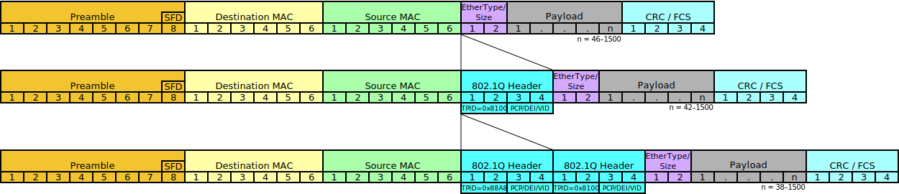

Karl's Backus-Naur Form
=======================

Version 1-prerelease


## WORK IN PROGRESS

Current status: 1.0-beta2 (Feb 18, 2023).

Public comments uncovered a number of issues that have mostly been addressed. Beta3 will be released soon after some more cleanup.


Introduction
------------

Syntactic metalanguages have made mainly haphazard gains over the past 60 years, and still only describe text-based formats. KBNF aims to be a modernized metalanguage with better expressivity and binary support.


### Introductory Example

To show what KBNF can do, here is an Ethernet IEEE 802.3 frame, layer 2 (image from [Wikipedia](https://en.wikipedia.org/wiki/IEEE_802.1Q)):



```kbnf
kbnf_v1 utf-8
- identifier  = 802.3_layer2
- description = IEEE 802.3 Ethernet frame, layer 2
- note        = Words are sent big endian, but octets are sent LSB first.

frame             = preamble
                  & frame_start
                  & dst_address
                  & src_address
                  & bind(etype, ether_type)
                  & [etype.type = 0x8100: dot1q_frame;
                     etype.type = 0x88a8: double_tag_frame;
                                        : payload_by_type(etype.type, 46);
                    ]
                  & frame_check
                  ;
preamble          = uint(8, 0b01010101){7};
frame_start       = uint(8, 0b11010101);
dst_address       = uint(48, ~);
src_address       = uint(48, ~);
ether_type        = uint(16, bind(type, ~));
frame_check       = uint(32, ~);
dot1q_frame       = tag_control_info
                  & bind(etype, ether_type)
                  & payload_by_type(etype.type, 42)
                  ;
double_tag_frame  = service_tag
                  & uint(16, 0x8100)
                  & customer_tag
                  & bind(etype, ether_type)
                  & payload_by_type(etype.type, 38)
                  ;
tag_control_info  = priority & drop_eligible & vlan_id;
service_tag       = tag_control_info;
customer_tag      = tag_control_info;
priority          = uint(3, ~);
drop_eligible     = uint(1, ~);
vlan_id           = uint(12, ~);

payload_by_type(type, min_size) = [type >= min_size & type <= 1500: payload(type);
                                   type = 0x0800                  : ipv4;
                                   type = 0x86dd                  : ipv6;
                                   # Other types omitted for brevity
                                  ];
payload(length)                 = uint(8,~){length};
ipv4: expression                = """https://somewhere/ipv4.kbnf""";
ipv6: expression                = """https://somewhere/ipv6.kbnf""";
```

See also: [IPv4 described in KBNF](ipv4.kbnf)


Contents
--------

- [Karl's Backus-Naur Form](#karls-backus-naur-form)
  - [WORK IN PROGRESS](#work-in-progress)
  - [Introduction](#introduction)
    - [Introductory Example](#introductory-example)
  - [Contents](#contents)
  - [Design Objectives](#design-objectives)
    - [Human readability](#human-readability)
    - [Better expressivity](#better-expressivity)
    - [Character set support](#character-set-support)
    - [Codepoints as first-class citizens](#codepoints-as-first-class-citizens)
    - [Binary grammar support](#binary-grammar-support)
    - [Future proof](#future-proof)
  - [Forward Notes](#forward-notes)
    - [About the Descriptions and Examples](#about-the-descriptions-and-examples)
    - [Bit Ordering](#bit-ordering)
    - [Non-Greedy](#non-greedy)
    - [Unicode Equivalence and Normalization](#unicode-equivalence-and-normalization)
  - [Grammar Document](#grammar-document)
    - [Document Header](#document-header)
  - [Rules](#rules)
    - [Start Rule](#start-rule)
    - [Symbols](#symbols)
    - [Macros](#macros)
    - [Functions](#functions)
      - [Function Parameter and Return Types](#function-parameter-and-return-types)
      - [Parameter and Return Type Alternatives](#parameter-and-return-type-alternatives)
      - [Variadic Functions](#variadic-functions)
    - [Expressions](#expressions)
    - [Identifier](#identifier)
  - [Types](#types)
    - [Bits](#bits)
    - [Number](#number)
      - [Numbers](#numbers)
    - [Condition](#condition)
  - [Variables](#variables)
  - [Literals](#literals)
    - [Numeric Literals](#numeric-literals)
    - [Codepoints](#codepoints)
    - [Strings](#strings)
    - [Escape Sequence](#escape-sequence)
      - [Codepoint Escape](#codepoint-escape)
    - [Prose](#prose)
  - [Switch](#switch)
  - [Combinations](#combinations)
    - [Concatenation](#concatenation)
    - [Alternative](#alternative)
    - [Exclusion](#exclusion)
    - [Repetition](#repetition)
  - [Grouping](#grouping)
  - [Calculations](#calculations)
  - [Ranges](#ranges)
  - [Comments](#comments)
  - [Builtin Functions](#builtin-functions)
    - [`sized` Function](#sized-function)
    - [`aligned` Function](#aligned-function)
    - [`limited` Function](#limited-function)
    - [`swapped` Function](#swapped-function)
    - [`bind` Function](#bind-function)
    - [`eod` Function](#eod-function)
    - [`unicode` Function](#unicode-function)
    - [`uint` Function](#uint-function)
    - [`sint` Function](#sint-function)
    - [`float` Function](#float-function)
    - [`inf` Function](#inf-function)
    - [`nan` Function](#nan-function)
    - [`nzero` Function](#nzero-function)
  - [The KBNF Grammar in KBNF](#the-kbnf-grammar-in-kbnf)


Design Objectives
-----------------

### Human readability

The primary use case for KBNF is to describe text and binary grammars in a formalized way in documentation. Such a format must therefore be human-accessible, while also being concise and unambiguous.

### Better expressivity

Binary formats tend to be structured in much more complicated ways than text formats in order to optimize for speed, throughput, or ease-of-processing. A metalanguage for describing such data will require much more expressivity than current metalanguages allow. Better expressivity reduces boilerplate and improves readability even in text format descriptions.

* **Repetition**: Any expression can have repetition applied to it, for a specific number of occurrences or a range of occurrences.
* **Bindings**: Some constructs (such as here documents or length delimited fields) require access to previously decoded values. KBNF supports assigning decoded values to variables.
* **Exclusion**: Sometimes it's easier to express something as "everything except for ...".
* **Grouping**: Grouping expressions together is an obvious convenince that most other BNF offshoots have already adopted.
* **Prose**: In many cases, the actual encoding of something is already well-known and specified elsewhere, or is too complex for KBNF to describe adequately. Prose offers a free-form way to describe part of a grammar.
* **Whitespace not significant**: Many BNF notations (including the original BNF) assign meaning to whitespace (for example: whitespace as concatenation, or linefeeds to mark the end of a rule). This is bad from a UX perspective because it makes things harder for a human to parse in many circumstances, and reduces the ways in which a rule can be expressed over multiple lines.

### Character set support

Metalanguages tend to support only ASCII, with Unicode (encoded as UTF-8) generally added as an afterthought. This restricts the usefulness of the metalanguage, as any other character sets (many of which are still in use) have no support at all.

KBNF can be used with any character set, and requires the character set to be specified as part of the grammar document header.

### Codepoints as first-class citizens

* Codepoints beyond the ASCII range must be directly inputtable into a grammar document.
* Difficult codepoints must also be supported (for example via escape sequences).
* [Unicode categories](https://unicode.org/glossary/#general_category) must be supported.

### Binary grammar support

Binary grammars have different needs from textual grammars, and require special support:

* **Bit arrays**: Binary formats tend to work at bit-level granularity, and thus require support for arbitrarily sized bit arrays.
* **Variables, Macros & Functions**: Binary formats often represent data in complex ways that can't be parsed without passing some context around.
* **Conditionals & Logic**: Binary formats often include or exclude portions based on encoded values elsewhere. Evaluating these requires the use of conditionals and logic operators.
* **Calculations**: Many binary field sizes are determined by data stored elsewhere in the document, and often they require calculations of some sort to determine the final field size.
* **Transformations**: Binary data often undergoes transformations that are too complex for normal BNF-style rules to express (for example [LEB128](https://en.wikipedia.org/wiki/LEB128)).

### Future proof

No specification is perfect, nor can it stand the test of time. Eventually an incompatible change will become necessary in order to stay relevant.

KBNF documents are versioned to a particular KBNF specification so that changes can be made to the specification without breaking existing tooling.


Forward Notes
-------------

### About the Descriptions and Examples

Descriptions and examples will usually include some KBNF notation. When in doubt, please refer to the [full KBNF grammar at the end of this document](#the-kbnf-grammar-in-kbnf).


### Bit Ordering

All sequences of bits (i.e. all [expressions](#expressions)) are assumed to be in big endian bit order (higher bits come first), and if necessary can be swapped at any granularity using the [`swapped` function](#swapped-function).

**For example**:

* `uint(16,0xc01f)` matches big endian 0xc01f (bit sequence 1,1,0,0,0,0,0,0,0,0,0,1,1,1,1,1).
* `swapped(8, uint(16,0xc01f))` matches little endian 0xc01f (bit sequence 0,0,0,1,1,1,1,1,1,1,0,0,0,0,0,0).
* `swapped(1, uint(16,0xc01f))` matches bit-swapped 0xc01f (bit sequence 1,1,1,1,1,0,0,0,0,0,0,0,0,0,1,1).

[Codepoints](#codepoints) follow the byte ordering of the character encoding scheme specified in the [document header](#document-header) (although per-byte bit ordering remains nominally big endian). Character sets with ambiguous byte ordering (such as `utf-16`) should generally be avoided in favor of those with explicit byte ordering (`utf-16be`, `utf-16le`).


### Non-Greedy

All expression matching is assumed to be non-greedy.

For example, given the following grammar:

```kbnf
document  = record+ & '.';
record    = letter+ & terminator;
letter    = 'a'~'z';
terminaor = "zzz";
```

The document `azzzbzzzczzz.` contains 3 records (`a`, `b`, and `c`), not one record (`azzzbzzzc`).


### Unicode Equivalence and Normalization

By default only the exact, non-processed (i.e. not normalized) codepoints present in a Unicode expression will be matched. For more advanced matching, define [functions](#functions) that apply normalization preprocessing or produce equivalence [alternatives](#alternative) to a string expression.


Grammar Document
----------------

A KBNF grammar document begins with a [header section](#document-header), followed by a series of [rules](#rules).

```kbnf
document = document_header & MAYBE_WSLC & start_rule & (MAYBE_WSLC & rule)*;
```


### Document Header

The document header identifies the file format as KBNF, and contains the following mandatory information:

* The version of the KBNF specification that the document adheres to.
* The case-insensitive name of the character encoding used for all codepoint related expressions (use the [IANA preferred MIME name](https://www.iana.org/assignments/character-sets/character-sets.xhtml) whenever possible).

Optionally, it may also include header lines. An empty line terminates the document header section.

```kbnf
document_header    = "kbnf_v" & kbnf_version & SOME_WS
                   & character_encoding & LINE_END
                   & header_line* & LINE_END
                   ;
character_encoding = ('a'~'z' | 'A'~'Z' | '0'~'9' | '_' | '-' | '.' | ':' | '+' | '(' | ')'){1~40};
header_line        = '-' & SOME_WS
                   & header_name & MAYBE_WS
                   & '=' & MAYBE_WS
                   & header_value & LINE_END
                   ;
header_name        = printable+;
header_value       = printable_ws+;
```

The following headers are officially recognized (all others are allowed, but are not standardized):

* `identifier`: A unique identifier for the grammar being described. It's customary to append a version number to the identifier.
* `description`: A brief, one-line description of the grammar.
* `kbnf_specification`: A pointer to the KBNF specification as a courtesy to anyone reading the document.

**Example**: A UTF-8 KBNF grammar called "mygrammar_v1".

```kbnf
kbnf_v1 utf-8
- identifier  = mygrammar_v1
- description = My first grammar, version 1
- kbnf_specification = https://github.com/kstenerud/kbnf/blob/master/kbnf_v1.md

document = "a"; # Yeah, this grammar doesn't do much...
```


Rules
-----

Rules determine the restrictions on how terminals can be combined into a valid sequence. A rule can define a [symbol](#symbols), a [macro](#macros), or a [function](#functions), and can work with or produce any of the standard [types](#types).

Rules are written in the form `nonterminal = expression;`, with optional whitespace (including newlines) between rule elements.

```kbnf
rule          = symbol_rule | macro_rule | function_rule;
start_rule    = symbol_rule;
symbol_rule   = symbol & TOKEN_SEP & '=' & TOKEN_SEP & expression & TOKEN_SEP & ';';
macro_rule    = macro & TOKEN_SEP & '=' & TOKEN_SEP & expression & TOKEN_SEP & ';';
function_rule = function & TOKEN_SEP & '=' & TOKEN_SEP & prose & TOKEN_SEP & ';';
```

The left part of a rule can define a [symbol](#symbols), a [macro](#macros), or a [function](#functions). Their case-sensitive names share the same global namespace (i.e. they must be globally unique).

**Note**: Whitespace in a KBNF rule is only used to separate tokens and for visual layout purposes; it does not imply any semantic meaning.


### Start Rule

The first rule listed in a KBNF document is the start rule. Only a [symbol](#symbols) that produces [bits](#bits) can be a start rule.


### Symbols

A symbol acts as a placeholder for something to be substituted in another rule.

```kbnf
symbol_rule           = symbol & TOKEN_SEP & '=' & TOKEN_SEP & expression & TOKEN_SEP & ';';
symbol                = identifier_restricted;
identifier_restricted = identifier_any ! reserved_identifiers;
identifier_any        = name;
name                  = name_firstchar & name_nextchar*;
name_firstchar        = unicode(L,M);
name_nextchar         = name_firstchar | unicode(N) | '_';
reserved_identifiers  = "sized" | "aligned" | "swapped" | "bind"
                      | "uint" | "sint" | "float" | "inf" | "nan" | "nzero";
```

**Note**: Symbol names are not limited to ASCII.

**Example**: A record consists of a company name (which must not contain two full-width colons in a row), followed by two full-width colons, followed by an employee count in full-width characters (possibly approximated to the nearest 10,000), and is terminated by a linefeed.

```kbnf
記録		= 会社名 & "：：" & 従業員数 & LF;
会社名		= unicode(L,M) & unicode(L,M,N,P,S,Zs)* ! "：：";
従業員数		= '１'~'９' & '０'~'９'* & '万'?;
LF		= '\[a]';
```

Or if you prefer, the same thing with English symbol names:

```kbnf
record         = company_name & "：：" & employee_count & LF;
company_name   = unicode(L,M) & unicode(L,M,N,P,S,Zs)* ! "：：";
employee_count = '１'~'９' & '０'~'９'* & '万'?;
LF             = '\[a]';
```

### Macros

A macro is essentially a symbol that accepts parameters, which are bound to local [variables](#variables) for use within the macro. The macro's contents are written like regular rules, but also have access to the injected local variables.

```kbnf
macro_rule = macro & TOKEN_SEP & '=' & TOKEN_SEP & expression & TOKEN_SEP & ';';
macro      = identifier_restricted & PARENTHESIZED(param_name & (ARG_SEP & param_name)*);
```

When called, a macro substitutes the passed-in parameters and proceeds like a normal rule would. Parameter and return [types](#types) are inferred based on how the parameters are used within the macro, and the type resulting from the macro's expression. The grammar is malformed if a macro is called with incompatible types, or is used in a context that is incompatible with its return type.

```kbnf
call       = identifier_any & PARENTHESIZED(call_param & (ARG_SEP & call_param)*);
call_param = any_type;
```

**Example**: The main section consists of three records: A type 1 record and two type 2 records. A record begins with a type byte, followed by a length byte, followed by that many bytes of data.

```kbnf
main_section = record(1) & record(2){2};
record(type) = byte(type) & byte(bind(length, ~)) & byte(~){length};
byte(v)      = uint(8,v);
```

In the above example, `record` must only be called with an unsigned integer, because the `type` field is passed to the `byte` macro, which calls the [`uint` function](#uint-function), which expects an unsigned parameter.

**Example**: An [IPV4](ipv4.kbnf) packet contains "header length" and "total length" fields, which together determine how big the "options" and "payload" sections are. "protocol" determines the protocol of the payload.

```kbnf
ip_packet                    = ...
                             & u4(bind(header_length, 5~)) # length is in 32-bit words
                               ...
                             & u16(bind(total_length, 20~)) # length is in bytes
                               ...
                             & u8(bind(protocol, registered_protocol))
                               ...
                             & options((header_length-5) * 32)
                             & payload(protocol, (total_length-(header_length*4)) * 8)
                             ;

options(bit_count)           = sized(bit_count, option*);
option                       = option_eool
                             | option_nop
                             | ...
                             ;

payload(protocol, bit_count) = sized(bit_count, payload_contents(protocol) & u1(0)*);
payload_contents(protocol)   = [protocol = 0: protocol_hopopt;
                                protocol = 1: protocol_icmp;
                                ...
                               ];
```

### Functions

Functions behave similarly to macros, except that they are opaque: whereas a macro is defined within the bounds of the grammatical notation, a function's procedure is either one of the [built-in functions](#builtin-functions), or is user-defined in [prose](#prose) (as a description, or as a URL pointing to a description).

Functions that take no parameters are defined and called without the trailing parentheses (similar to defining or calling a [symbol](#symbols)).

#### Function Parameter and Return Types

Since functions are opaque, their parameter and return [types](#types) cannot be automatically deduced like they can for [macros](#macros). Functions therefore declare all parameter and return [types](#types). If a function is called with the wrong types or its return value is used in an incompatible context, the grammar is malformed.

The following standard types are recognized:

* `bits`
* `condition`
* `number`
* `numbers`
* `uinteger`
* `uintegers`
* `sinteger`
* `sintegers`

Custom types may be invented (or further invariants defined) when the standard types are insufficient (such as in the [unicode function](#unicode-function)), provided their textual representation doesn't cause ambiguities with the KBNF document encoding.

#### Parameter and Return Type Alternatives

If a function can accept multiple types in a particular parameter, or can return multiple types, those types will be listed, separated by the pipe (`|`) character. See the [bind function](#bind-function) as an example.

#### Variadic Functions

The last parameter in a function can be made variadic by appending `...` (such as in the [unicode function](#unicode-function)).


```kbnf
function_rule      = function & TOKEN_SEP & '=' & TOKEN_SEP & prose & TOKEN_SEP & ';';
function           = function_no_args | function_with_args;
function_no_args   = identifier_restricted & TOKEN_SEP & type_specifier;
function_with_args = identifier_restricted
                   & PARENTHESIZED(function_param & (ARG_SEP & function_param)*)
                   & TOKEN_SEP & type_specifier
                   ;
function_param     = param_name & TOKEN_SEP & type_specifier;
type_specifier     = ':' & TOKEN_SEP & type_alternatives & (TOKEN_SEP & vararg)?;
type_alternatives  = maybe_ranged_type & (TOKEN_SEP & '|' & TOKEN_SEP & maybe_ranged_type)*;
vararg             = "...";
maybe_ranged_type  = '~'? & (basic_type_name | custom_type_name);
basic_type_name    = "bits"
                   | "condition"
                   | "number"
                   | "numbers"
                   | "uinteger"
                   | "uintegers"
                   | "sinteger"
                   | "sintegers"
                   ;
custom_type_name   = name;
```

**Example**: A function to convert an unsigned int to its unsigned little endian base 128 representation.

```kbnf
uleb128(v: uinteger): expression = """https://en.wikipedia.org/wiki/LEB128#Unsigned_LEB128""";
```

**Example**: A record contains a date followed by a colon, followed by a temperature reading.

```kbnf
record              = iso8601 & ':' & temperature;
iso8601: expression = """https://en.wikipedia.org/wiki/ISO_8601#Combined_date_and_time_representations""";
temperature         = digit+ & ('.' & digit+)?;
digit               = '0'~'9';
```


### Expressions

Expressions form the body of a rule.

- can produce bits, numbers, or a conditon.


### Identifier

A unique identifier for [symbols](#symbols), [macros](#macros), and [functions](#functions) (which are all scoped globally), or [variables](#variables) (which are scoped locally).

Identifiers are case sensitive, and must be unique to their scope. Locally scoped identifiers (i.e. variable names) must be unique to _both_ the local and global scope (name shadowing is not allowed).

Identifiers start with a letter, and can contain letters, numbers and the underscore character. The [builtin function names](#builtin-functions) are reserved at the global scope.

The general convention is to use all uppercase identifiers for "background-y" things like whitespace and separators and other structural components, which makes them easier for a human to gloss over (see [the KBNF grammar document](#the-kbnf-grammar-in-kbnf) as an example).

```kbnf
identifier           = (identifier_firstchar & identifier_nextchar*) ! reserved_identifiers;
identifier_firstchar = unicode(L,M);
identifier_nextchar  = identifier_firstchar | unicode(N) | '_';
reserved_identifiers = "sized" | "aligned" | "swapped" | "bind"
                     | "uint" | "sint" | "float" | "inf" | "nan" | "nzero"
                     ;
```


Types
-----

KBNF has three main types:

* [`bits`](#bits): A set of possible bit sequences of arbitrary length.
* [`numbers`](#number): Numeric values that may be used in calculations or even converted to a representations in bits. Number types are split into two primary forms:
  - [singular number](#number): A single numeric value.
  - [number set](#numbers): A set of values.
* [`conditions`](#condition): True or false assertions about the current state.

Types become relevant when calling [functions](#functions), which have restrictions on what types they accept and return. Also, [repetition](#repetition) amounts are restricted to unsigned integers.


### Bits

The bits type represents the set of possible bit sequences that can be matched at a particular point.

Bits are produced by [codepoints](#codepoints), [strings](#strings), and [some functions](#builtin-functions), and can be of arbitrary length (i.e. not just a multiple of 8 bits).

The bits type is a set of bit patterns, and can therefore be composed using [alternatives](#alternative), [concatenation](#concatenation), and [repetition](#repetition).

```kbnf
expression = symbol
           | call
           | string_literal
           | maybe_ranged(codepoint_literal)
           | combination
           | builtin_functions
           | variable
           | grouped(expression)
           ;
```

**Example**: Each UTC timestamp field is stored in its own bitfield, with the final constructed 64 bit value stored in little endian byte order:

Bit fields (high to low):

| Field       | Min | Max    | Bits |
| ----------- | --- | ------ | ---- |
| Year        | 0   | 262143 | 18   |
| Month       | 1   | 12     | 4    |
| Day         | 1   | 31     | 5    |
| Hour        | 0   | 23     | 5    |
| Minute      | 0   | 59     | 6    |
| Second      | 0   | 60     | 6    |
| Microsecond | 0   | 999999 | 20   |

```kbnf
timestamp   = swapped(8, year & month & day & hour & minute & second & microsecond);
year        = uint(18, ~);
month       = uint(4, 1~12);
day         = uint(5, 1~31);
hour        = uint(5, 0~23);
minute      = uint(6, 0~59);
second      = uint(6, 0~60); # Mustn't forget leap seconds!
microsecond = uint(20, 0~999999);
```

### Number

The `number` type represents mathematical reals (not computer floating point values, which are an implementation detail). Numbers can be used in [calculations](#calculations), numeric [ranges](#ranges), [repetition](#repetition), and as parameters to or return types from [functions](#functions). They can also be converted to [bits](#bits) using [functions](#functions) such as [float](#float-function), [sint](#sint-function), and [uint](#uint-function).

Numbers can be expressed as [numeric literals](#numeric-literals), or derived from [functions](#functions), [variables](#variables), and [calculations](#calculations).

The two most common numeric invariants are supported natively as pseudo-types:

* The `sinteger` (signed integer) pseudo-type restricts values to positive and negative integers, and 0.
* The `uinteger` (unsigned integer) pseudo-type restricts values to positive integers and 0.

These pseudo-types only place restrictions on the final realized value; they are still `number` types and behave like mathematical reals for all operations, with the destination invariant type (such as a [function](#functions) parameter's type) restricting what resulting values are allowed.

**Note**: Unlike in the [`numbers`](#numbers) type, values that break a `number` invariant represent an erroneous condition. A value that breaks its invariant (e.g. 0.5 passed to a `sinteger` or `uinteger` parameter) results in no match for anything that depends on it, and ideally should cause a diagnostic in a codec implementation.

#### Numbers

The `numbers` type (and associated pseudo-type invariants `sintegers` and `uintegers`) represents sets of [numbers](#number). Number sets are commonly used in [repetition](#repetition), or passed as arguments to certain [functions](#builtin-functions) (such as [sint](#sint-function), [uint](#uint-function), [float](#float-function)) to produce sets of [bits](#bits).

Number sets are produced using [ranges](#ranges), [alternatives](#alternative), and [exclusion](#exclusion).

**Note**: Any value in a number set that breaks its invariant is silently removed from the set. For example `0~1.5` passed to a `sintegers` invariant will be reduced to the set of integer values 0 and 1. `0.5~0.6` passed to a `sintegers` invariant will be reduced to the empty set. `-5` passed to a `uintegers` invariant will be reduced to the empty set.

**Examples**:

* `1 | 5 | 30`: The set of numbers 1, 5, and 30.
* `1~3`: All numbers from 1 to 3. If passed to an integer context, this would be equivalent to `1 | 2 | 3`.
* `1~300 ! 15`: All numbers from 1 to 300, except for 15.
* `(1~low | high~900) ! 200~600`: All numbers from 1 to the `low` variable or from the `high` variable to 900, except for anything from 200 to 600.

### Condition

Conditions are produced by comparing [numbers](#number), and by performing logical operations on those comparisons, resulting in either true or false. Conditions are used in [switches](#switch), and can be [grouped](#grouping).

Comparisons:

* Less than (`<`)
* Less than or equal to (`<=`)
* Equal to (`=`)
* Not equal to (`!=`)
* Greater than or equal to (`>=`)
* Greater than (`>`)

Logical operations:

* And (`&`)
* Or (`|`)
* Not (`!`), which is a unary operator

Condition precedence (low to high):

* comparisons
* logical or
* logical and
* logical not

```kbnf
condition          = comparison | logical_op;
logical_op         = logical_or | logical_op_and_not;
logical_op_and_not = logical_and | logical_op_not;
logical_op_not     = logical_not | maybe_grouped(condition);
comparison         = number & TOKEN_SEP & comparator & TOKEN_SEP & number;
comparator         = comp_lt | comp_le | comp_eq | comp_ne | comp_ge | comp_gt;
comp_lt            = "<";
comp_le            = "<=";
comp_eq            = "=";
comp_ne            = "!=";
comp_ge            = ">=";
comp_gt            = ">";
logical_or         = condition & TOKEN_SEP & '|' & TOKEN_SEP & condition;
logical_and        = condition & TOKEN_SEP & '&' & TOKEN_SEP & condition;
logical_not        = '!' & TOKEN_SEP & condition;
```

**Example**:

```kbnf
record       = uint(8, bind(type, 1~))
             & [type = 1: type_1;
                type = 2: type_2;
                        : type_default;
               ];
type_1       = ...
type_2       = ...
type_default = ...
```


Variables
---------

In some contexts, resolved data (data that has already been matched) or literal values can be bound to a variable for use elsewhere. Variables are bound either manually using the [`bind`](#bind-function) builtin function, or automatically when passing parameters to a [macro](#macros). The variable's [type](#types) is inferred from its provenance and where it is ultimately used (a type mismatch indicates a malformed grammar).

**Note**: Variables cannot be re-bound.

When [binding](#bind-function) an [expression](#expressions) that itself binds a variable, that expression's bound variables are accessible from the outer scope using dot notation (`this_exp_bound_value.sub_exp_bound_value`).

**Example**: A document consists of a type 1 record, followed by any number of type 5, 6, and 7 records, and is terminated with a type 0 record of length 0. A record begins with a header consisting of an 8-bit type and a 16-bit big endian unsigned integer indicating how many bytes of record data follow.

```kbnf
document            = record(1) & (record(5) | record(6) | record(7))* & terminator_record;
record(type)        = bind(header, record_header(type)) & record_data(header.length);
record_header(type) = u8(type) & u16(bind(length, ~));
record_data(length) = u8(~){length};
terminator_record   = u8(0) u16(0);
u8(v)               = uint(8, v);
u16(v)              = uint(16, v);
```

* The `record` rule (a [macro](#macros) because it takes parameters) binds the result of the `record_header` rule to a variable called `header`. This gives it access to the `record_header` `length` variable as `header.length`.
* The `record_header` rule specifies an 8-bit type value (a variable passed in to the macro as a parameter), and binds a 16-bit integer value to a variable called `length`.
* The `record_data` rule takes a length parameter and matches that many bytes using [repetition](#repetition).


Literals
--------

### Numeric Literals

Numeric literals can be expressed in binary, octal, decimal, or hexadecimal notation for integers, and in decimal or hexadecimal notation for reals.

**Note**: Decimal real notation translates more cleanly to decimal float encodings such as [ieee754 decimal](https://en.wikipedia.org/wiki/Decimal64_floating-point_format), and hexadecimal real notation translates more cleanly to binary float encodings such as [ieee754 binary](https://en.wikipedia.org/wiki/Double-precision_floating-point_format).

Conversions from literal reals to floating point encodings that differ in base are assumed to follow the generally accepted algorithms for such conversions (e.g. `Grisu`, `std::strtod`).

```kbnf
number_literal       = int_literal_bin | int_literal_oct | int_real_literal_dec | int_real_literal_hex;
int_real_literal_dec = neg? digit_dec+
                     & ('.' & digit_dec+ & (('e' | 'E') ('+' | '-')? & digit_dec+)?)?
                     ;
int_real_literal_hex = neg? & '0' & ('x' | 'X') & digit_hex+
                     & ('.' & digit_hex+ & (('p' | 'P') & ('+' | '-')? & digit_dec+)?)?
                     ;
int_literal_bin      = neg? & '0' & ('b' | 'B') & digit_bin+;
int_literal_oct      = neg? & '0' & ('o' | 'O') & digit_oct+;
neg                  = '-';
```

**Examples**:

```kbnf
header_signature = uint(5, 0b10111);
ascii_char_8bit  = uint(8, 0x00~0x7f);
tolerance        = float(32, -1.5~1.5);
```


### Codepoints

Codepoints can be represented as literals, [ranges](#ranges), and [category sets](#unicode-function). Codepoint literals are placed between single or double quotes.

Expressing codepoint literals as a [range](#ranges) causes every codepoint in the range to be added as an [alternative](#alternative).

```kbnf
codepoint_literal = '"' & maybe_escaped(printable_ws ! '"'){1} & '"'
                  | "'" & maybe_escaped(printable_ws ! "'"){1} & "'"
                  ;
```

**Examples**:

```kbnf
letter_a     = 'a';     # or "a"
a_to_c       = 'a'~'c'; # or "a"~"c", or 'a' | 'b' | 'c', or "a" | "b" | "c"
alphanumeric = unicode(L,N);
```

### Strings

A string is syntactic sugar for a series of specific [codepoints](#codepoints) [concatenated](#concatenation) together. String literals are placed between single or double quotes.

```kbnf
string_literal = '"' & maybe_escaped(printable_ws ! '"'){2~} & '"'
               | "'" & maybe_escaped(printable_ws ! "'"){2~} & "'"
               ;
```

**Example**: The following are all equivalent:

```kbnf
str_abc_1 = "abc";
str_abc_2 = 'abc';
str_abc_3 = "a" & "b" & "c";
str_abc_4 = 'a' & 'b' & 'c';
```


### Escape Sequence

[Codepoint literals](#codepoints), [string literals](#strings), and [prose](#prose) may contain codepoint escape sequences to represent troublesome codepoints.

Escape sequences are initiated with the backslash (`\`) character. If the next character following is an open square brace (`[`), it begins a [codepoint escape](#codepoint-escape). Otherwise the sequence represents that literal character.

```kbnf
escape_sequence = '\\' & (printable ! '[') | codepoint_escape);
```

**Example**: A string containing double quotes.

```kbnf
mystr = "This is a \"string\""; # or using single quotes: 'This is a "string"'
```

#### Codepoint Escape

A codepoint escape interprets the hex digits between the sequence `\[` and `]` as the hexadecimal numeric value of the codepoint being referred to.

```kbnf
codepoint_escape = '[' & digit_hex+ & ']';
```

**Example**: Emoji

```kbnf
mystr = "This is a \[1f415]"; # "This is a 🐕"
```

### Prose

Prose is meant as a last resort in attempting to describe something. If it has already been described elsewhere, you could put a URL in here. Otherise you could put in a natural language description.

```kbnf
prose = '"""' & (maybe_escaped(printable_wsl)+ ! '"""') & '"""'
      | "'''" & (maybe_escaped(printable_wsl)+ ! "'''") & "'''"
      ;
```

**Note**: Prose can only be used to define a [function](#functions) because it is by nature opaque; the function definition will assign types.

**Example**: A record contains a date and temperature separated by `:`, followed by a newline, followed by a flowery description of any length in iambic pentameter (newlines allowed), terminated by `=====` on its own line.

```kbnf
record              = date & ':' & temperature & LF & flowery_description & LF & '=====' & LF;
date                = """YYYY-MM-DD, per https://en.wikipedia.org/wiki/ISO_8601#Calendar_dates""";
temperature         = digit+ & ('.' & digit+)?;
digit               = '0'~'9';
flowery_description: expression = """
A poetic description of the weather, written in iambic pentameter. For example:

While barred clouds bloom the soft-dying day,
And touch the stubble-plains with rosy hue;
Then in a wailful choir the small gnats mourn
Among the river sallows, borne aloft
Or sinking as the light wind lives or dies.
""";
```


Switch
------

A switch chooses one expression from a series of possibilities based on condition matching. When no conditions match, the default expression (if any) is produced.

**Note**: If more than one condition can match at the same time, the grammar is ambiguous.

```kbnf
switch         = '[' & TOKEN_SEP & switch_entry+ & (TOKEN_SEP & switch_default)? & TOKEN_SEP & ']';
switch_entry   = condition & TOKEN_SEP & ':' & TOKEN_SEP & expression & TOKEN_SEP & ';';
switch_default = ':' & TOKEN_SEP & expression & TOKEN_SEP & ';';
```

**Example**: TR-DOS file descriptors contain differnt payload formats based on the extension.

```kbnf
file_descriptor  = filename
                 & bind(ext, extension)
                 & [ ext.type = 'B': format_basic;
                     ext.type = 'C': format_code;
                     ext.type = 'D': format_data;
                                   : format_generic;
                   ]
                 & file_length
                 & start_sector
                 & start_track
                 ;

filename         = sized(8*8, uint(8,~)+ & uint(8,' ')*);
extension        = uint(8, bind(type, ~));
file_length      = uint(8, ~);
start_sector     = uint(8, ~);
start_track      = uint(8, ~);

format_basic     = program_length & variables_offset;
program_length   = uint(16,~);
variables_offset = uint(16,~);

format_code      = load_addres & file_length;
load_address     = uint(16,~);
file_length      = uint(16,~);

format_data      = data_type & file_length;
data_type        = uint(16,~);
```


Combinations
------------

Combinations combine expressions together into more powerful expressions.

Combination precedence (low to high):

* [Alternative](#alternative)
* [Exclusion](#exclusion)
* [Concatenation](#concatenation)
* [Repetition](#repetition)


### Concatenation

The concatenation combination produces an expression consisting of the expression on the left, followed by the expression on the right (both must match in their proper order for the combined expression to match). The operator symbol is `&` (think of it as meaning "x and then y").

Only [bits](#bits) can be concatenated.

```kbnf
concatenate = expression & TOKEN_SEP & '&' & TOKEN_SEP & expression;
```

**Example**: Assignment consists of an identifier, at least one space, an equals sign, at least one space, and then an integer value, followed by a linefeed.

```kbnf
assignment = "a"~"z"+ 
           & " "+
           & "="
           & " "+
           & "0"~"9"+
           & "\[a]"
           ;
```


### Alternative

The alternative combination produces an expression that can match either the expression on the left or the expression on the right.

Alternatives are separated by a pipe (`|`) character. Only one of the alternative branches will be taken.

[Bits](#bits) and [numbers](#numbers) sets can be built using alternatives.

```kbnf
alternate = expression & TOKEN_SEP & '|' & TOKEN_SEP & expression;
```

**Example**: Addition or subtraction consists of an identifier, at least one space, a plus or minus sign, at least one space, and then another identifier, followed by a linefeed.

```kbnf
caculation = "a"~"z"+
           & " "+
           & ("+" | "-")
           & " "+
           & "a"~"z"+
           & "\[a]"
           ;
```


### Exclusion

Exclusion removes an expression from the set of expression alternatives.

[Bits](#bits) and [numbers](#numbers) sets can be modified using exclusion.

```kbnf
exclude = expression & TOKEN_SEP & '!' & TOKEN_SEP & expression;
```

**Example**: An identifier can be any lowercase ASCII string except "fred".

```kbnf
identifier = "a"~"z"+ ! "fred";
```


### Repetition

"Repetition" is a bit of a misnomer, because it actually defines how many times an expression occurs, not how many times it repeats. Repetition amounts can be defined as a [range](#ranges) or as a discrete amount. Think of repetition as "this [expression](#expressions), [concatenated](#concatenation) together for this range of occurrences".

The repetition amount is an unsigned integer, appended to an expression as a discrete amount or [range](#ranges) between curly braces (e.g. `{10}` or `{1~5}`). There are also shorthand notations for common cases:

* `?`: Zero or one (equivalent to `{0~1}`)
* `*`: Zero or more (equivalent to `{0~}`)
* `+`: One or more (equivalent to `{1~}`)

Only [bits](#bits) can have repetition applied.

```kbnf
repetition          = repeat_range | repeat_zero_or_one | repeat_zero_or_more | repeat_one_or_more;
repeat_range        = expression & '{' & TOKEN_SEP & maybe_ranged(number) & TOKEN_SEP & '}';
repeat_zero_or_one  = expression & '?';
repeat_zero_or_more = expression & '*';
repeat_one_or_more  = expression & '+';
```

**Example**: An identifier is 5, 6, 7, or 8 characters long, and is made up of characters from 'a' to 'z'.

```kbnf
identifier = 'a'~'z'{5~8};
```

**Example**: An identifier must start with at least one uppercase ASCII letter, optionally followed by any number of lowercase ASCII letters, and optionally suffixed with an underscore.

```kbnf
identifier = 'A'~'Z'+ & 'a'~'z'* & '_'?;
```


Grouping
--------

[Bits](#bits), [calculations](#calculations) and [conditions](#condition) can be grouped in order to override the default precedence, or as a visual aid to make things more readable. To group, place the items between parentheses.

```kbnf
grouped(item)       = PARENTHESIZED(item);
PARENTHESIZED(item) = '(' & TOKEN_SEP & item & TOKEN_SEP & ')';
```

**Exmples**:

```kbnf
my_rule         = ('a' | 'b') & ('x' | 'y');
my_macro1(a)    = uint(8, (a + 5) * 2);
my_macro2(a, b) = [(a < 10 | a > 20) & (b < 10 | b > 20): "abc";
                                                        : "def";
                  ];
```


Calculations
------------

Calculations perform arithmetic operations on [numbers](#numbers), producing a new number. All operands are treated as mathematical reals for the purpose of the calculation.

The following operations can be used:

* Add (`+`)
* Subtract (`-`)
* Multiply (`*`)
* Divide (`/`)
* Modulo (`%`)
* Power (`^`, where `x^y` means x to the power of y)
* Negation ('-')

**Notes**:

* Division by zero is undefined behavior. Any grammar that allows division by zero to occur is ambiguous.
* Depending on the operands, the modulo operation can produce two different values depending on how the remainder is derived. Modulo in KBNF follows the approach of C, ADA, PL/1, and Common Lisp of choosing the remainder with the same sign as the divisor.

Operator precedence (low to high):

* add, subtract
* multiply, divide, modulus
* power
* negation

```kbnf
number       = calc_add | calc_sub | calc_mul_div;
calc_mul_div = calc_mul | calc_div | calc_mod | calc_pow_neg;
calc_pow_neg = calc_pow | calc_neg_val;
calc_neg_val = calc_neg | calc_val;
calc_val     = number_literal | variable | maybe_grouped(number);
calc_add     = number & TOKEN_SEP & '+' & TOKEN_SEP & calc_mul_div;
calc_sub     = number & TOKEN_SEP & '-' & TOKEN_SEP & calc_mul_div;
calc_mul     = calc_mul_div & TOKEN_SEP & '*' & TOKEN_SEP & calc_pow_val;
calc_div     = calc_mul_div & TOKEN_SEP & '/' & TOKEN_SEP & calc_pow_val;
calc_mod     = calc_mul_div & TOKEN_SEP & '%' & TOKEN_SEP & calc_pow_val;
calc_pow     = calc_pow_val & TOKEN_SEP & '^' & TOKEN_SEP & calc_neg_val;
calc_neg     = '-' & calc_val;
```

**Example**: A record begins with a 4-bit length field (length is in 32-bit increments) and 4-bit flags field containing (...), followed by the contents of the record.

```kbnf
record = uint(4, bind(length, ~)) & flags & uint(8, ~){length*4};
flags  = ...
```


Ranges
------

A range consists of one of the following:

* A low value and a high value separated by a tilde (low ~ high), indicating a (closed interval) low and high bound.
* A low value followed by a tilde (low ~), indicating a low bound only.
* A tilde followed by a high value (~ high), indicating a high bound only.
* A tilde by itself (~), indicating no bound.
* A value with no tilde, restricting the "range" to only that value.

A [codepoint](#codepoints) range represents the set of each codepoint in the range as [alternatves](#alternative).

A [repetition](#repetition) range represents a range in the number of occurrences that will match the rule.

A [number](#numbers) range will ultimately be passed to a context requiring a specific [subtype](#types) (such as [repetition](#repetition), [uint](#uint-function), [sint](#sint-function), [float](#float-function)), and will thus represent each value in the range (for all discrete values that are representable by the [subtype](#types)) as [alternatves](#alternative).

```kbnf
expression         = ...
                   | maybe_ranged(codepoint_literal)
                   | ...
                   ;
repeat_range       = expression & '{' & TOKEN_SEP & maybe_ranged(number) & TOKEN_SEP & '}';
function_uint      = fname_uint & PARENTHESIZED(bit_count & ARG_SEP & maybe_ranged(number));
function_sint      = fname_sint & PARENTHESIZED(bit_count & ARG_SEP & maybe_ranged(number));
function_float     = fname_float & PARENTHESIZED(bit_count & ARG_SEP & maybe_ranged(number));
ranged(item)       = (item & TOKEN_SEP)? & '~' & (TOKEN_SEP & item)?;
maybe_ranged(item) = item | ranged(item);
```

**Example**: Codepoint range.

```kbnf
hex_digit = ('0'~'9' | 'a'~'f');
```

**Example**: Repetition range: A name field contains between 1 and 100 characters.

```kbnf
name_field = unicode(L,M,N,P,S){1~100};
```

**Example**: Number range: The RPM value is an unsigned 16 bit big endian integer from 0 to 1000.

```kbnf
rpm = uint(16, ~1000); # It's a uint, so already limited to 0~
```


Comments
--------

A comment begins with a hash char (`#`) and continues to the end of the current line. Comments can be placed after pretty much any token.

```kbnf
comment = '#' & (printable_ws ! LINE_END)* & LINE_END;
```

**Example**:

```kbnf
kbnf_v1 utf-8
- identifier = mygrammar_v1
- description = My first grammar

# This is the first place where a comment can exist.
myrule # comment
 = # comment
 myexpression # comment
 ; # comment
# comment
```


Builtin Functions
-----------------

KBNF comes with some fundamental functions built-in:

### `sized` Function

```kbnf
sized(bit_count: uinteger, expr: expression): expression =
    """
    Requires that `expr` produce exactly `bit_count` bits.
    Expressions containing repetition that would have matched on their own are
    no longer sufficient until the production fills exactly `bit_count` bits.

    if `bit_count` is 0, `expr` has no size requirements.
    """;
```

**Example**: A name field must contain exactly 200 bytes worth of character data, padded with spaces as needed.

```kbnf
name_field = sized(200*8, unicode(L,M,N,P,Zs)* & ' '*);
```

Technically, the `& ' '*` part is superfluous since Unicode category `Zs` already includes space, but it helps readability to highlight how to pad the field. One could even be more explicit:

```kbnf
name_field    = sized(200*8, unicode(L,M,N,P,Zs)* & space_padding);
space_padding = ' '*;
```

**Example**: The "records" section can contain any number of length-delimited records, but must be exactly 1024 bytes long. This section can be padded with 0 length records (which is a record with a length field of 0 and no payload - essentially a zero byte).

```kbnf
record_section     = sized(1024*8, record* & zero_length_record*);
record             = byte(bind(length,~)) & byte(~){length};
zero_length_record = byte(0);
byte(v)            = uint(8,v);
```

### `aligned` Function

```kbnf
aligned(bit_count: uinteger, expr: expression, padding: expression): expression =
    """
    Requires that `expr` and `padding` together produce a multiple of `bit_count` bits.
    If `expr` doesn't produce a multiple of `bit_count` bits, the `padding` expression
    is used in the same manner as the `sized` function to produce the remaining bits.

    if `bit_count` is 0, `expr` has no alignment requirements and `padding` is ignored.
    """;
```

**Example**: The "records" section can contain any number of length-delimited records, but must end on a 32-bit boundary. This section can be padded with 0 length records (which is a record with a length field of 0 and no payload - essentially a zero byte).

```kbnf
record_section     = aligned(32, record*, zero_length_record*);
record             = byte(bind(length,~)) & byte(~){length};
zero_length_record = byte(0);
byte(v)            = uint(8, v);
```

### `limited` Function

```kbnf
limited(bit_counts: uintegers, expr: expression): expression =
    """
    Limits `expr` to any of the bit counts contained in `bit_counts`.
    """;
```

**Exammple**: A section contains at least 1 length delimited record (which can contain 1-100 bytes of payload each), and must be between 2 and 1024 bytes in total.

```kbnf
section = limited(2*8~1024*8, record+);
record = uint(8,bind(length, 1~100)) uint(8,~){length};
```

### `swapped` Function

```kbnf
swapped(bit_granularity: uinteger, expr: expression): expression =
    """
    Swaps all bits of `expr` in chunks of `bit_granularity` size.

    For example, given some nominal bits = ABCDEFGHIJKLMNOP:
        swapped(8, bits) -> IJKLMNOPABCDEFGH
        swapped(4, bits) -> MNOPIJKLEFGHABCD
        swapped(2, bits) -> OPMNKLIJGHEFCDAB
        swapped(1, bits) -> PONMLKJIHGFEDCBA

    If `expr` doesn't resolve to a multiple of `bit_granularity` bits, the
    resulting expression matches nothing.


    if `bit_granularity` is 0, `expr` is passed through unchanged.
    """;
```

**Example**: A document begins with a 32-bit little endian unsigned int version field, followed by the contents. Only version 5 documents are supported.

```kbnf
document  = version_5 & contents;
version_5 = swapped(8, uint(32, 5));
contents  = ...
```

**Example**: A header begins with a 16-bit unsigned int identifier that is actually bit-swapped, followed by contents based on the identifier.

```kbnf
header               = bitswapped_uint16(bind(identifier, ~)) & contents(identifier);
bitswapped_uint16(v) = swapped(1, uint(16, v));
contents(identifier) = [identifier = 1: type_1;
                        identifier = 2: type_2;
                       ];
type_1               = ...
type_2               = ...
```

### `bind` Function

```kbnf
bind(variable_name: identifier, value: expression | ~number): expression | ~number =
    """
    Binds `value` to a local variable for subsequent re-use in the current rule.
    `bind` transparently passes through the type and value of `value`, meaning that
    the context around the `bind` call behaves as though only what the `bind`
    function surrounded is present. This allows a match as normal, while also
    allowing the resolved value to be used again later in the rule.
    """;
```

**Example**: Match "abc/abc", "fred/fred" etc.

```kbnf
sequence = bind(repeating_value,('a'~'z')+) & '/' & repeating_value;
```

**Example**: BASH "here" document: Bind the variable "terminator" to whatever follows the "<<" until the next linefeed. The here-document contents continue until the terminator value is encountered again.

```kbnf
here_document             = "<<" & bind(terminator, NOT_LF+) & LF & here_contents(terminator) & terminator;
here_contents(terminator) = ANY_CHAR* ! terminator;
ANY_CHAR                  = ~;
LF                        = '\[a]';
NOT_LF                    = ANY_CHAR ! LF;
```

**Example**: Interpret the next 16 bits as a big endian unsigned int and bind the resolved number to "length". That many following bytes make up the record contents.

```kbnf
length_delimited_record = uint16(bind(length, ~)) & record_contents(length);
record_contents(length) = byte(~){length};
uint16(v)               = uint(16, v);
byte(v)                 = uint(8, v);
```

### `eod` Function

```kbnf
eod: expression =
   """
   A special expression that matches the end of the data stream.
   """
```

**Exammple**: A document contains any number of length delimited records (1-100 bytes), continuing until the end of the file.

```kbnf
document = record* eod;
record = uint(8,bind(length, 1~100)) uint(8,~){length};
```

### `unicode` Function

```kbnf
unicode(categories: unicode_category ...): expression =
    """
    Creates an expression containing the alternatives set of all Unicode
    codepoints that have any of the given Unicode categories.

    `categories` is a comma separated list of 1 letter major category or 2-letter minor
    category names, as listed in https://www.unicode.org/versions/Unicode15.0.0/ch04.pdf#G134153

    Example: all letters and space separators: unicode(L,Zs)
    """;
```

**Example**: Allow letter, numeral, and space characters.

```kbnf
letter_digit_space = unicode(N,L,Zs);
```

### `uint` Function

```kbnf
uint(bit_count: uinteger, values: uintegers): expression =
    """
    Creates an expression that matches every discrete bit pattern that can be
    represented in the given values set as big endian unsigned integers of
    size `bit_count`.
    """;
```

**Example**: The length field is a 16-bit unsigned integer value.

```kbnf
length = uint(16, ~);
```


### `sint` Function

```kbnf
sint(bit_count: uinteger, values: sintegers): expression =
    """
    Creates an expression that matches every discrete bit pattern that can be
    represented in the given values set as big endian 2's complement signed
    integers of size `bit_count`.
    """;
```

**Example**: The points field is a 16-bit signed integer value from -10000 to 10000.

```kbnf
points = sint(32, -10000~10000);
```


### `float` Function

```kbnf
float(bit_count: uinteger, values: numbers): expression =
    """
    Creates an expression that matches every discrete bit pattern that can be
    represented in the given values set as big endian ieee754 binary floating
    point values of size `bit_count`.
    Note that expressions produced by this function will never include the
    special infinity values, NaN values, or negative 0, for which there are
    specialized functions.
    `bit_count` must be a valid size according to ieee754 binary.
    """;
```

**Example**: The temperature field is a 32-bit float value from -1000 to 1000.

```kbnf
rpm = float(32, -1000~1000);
```

**Example**: Accept any 64-bit binary ieee754 float.

```kbnf
any_float64 = float(64,~) | inf(64,~) | nan(64,~) | nzero(64);
```


### `inf` Function

```kbnf
inf(bit_count: uinteger, sign: numbers): expression =
    """
    Creates an expression that matches big endian ieee754 binary infinity values
    of size `bit_count` whose sign matches the `sign` values set. One or two
    matches will be made (positive infinity, negative infinity) depending on
    whether the `sign` values include both positive and negative values or not.
    `bit_count` must be a valid size according to ieee754 binary.
    """;
```

**Example**: Negative infinity used as a record terminator.

```kbnf
record     = reading* terminator;
reading    = float(32, ~) ! terminator;
terminator = inf(32, -1);
```


### `nan` Function

```kbnf
nan(bit_count: uinteger, payload: sintegers): expression =
    """
    Creates an expression that matches every big endian ieee754 binary NaN value
    size `bit_count` with the given payload values set. NaN payloads can be
    positive or negative, up to the min/max value allowed for a NaN payload in a
    float of the given size (10 bits for float-16, 23 bits for float32, etc).
    `bit_count` must be a valid size according to ieee754 binary.

    Notes:
    - The absolute value of `payload` is encoded, with the sign going into the
      sign bit (i.e. the value is not encoded as 2's complement).
    - The payload value 0 is automatically removed from the possible matches
      because such an encoding would be interpreted as infinity.
    """;
```

**Example**: Quiet NaN used to mark invalid readings.

```kbnf
record  = reading{32};
reading = float(32, ~) | invalid;
invalid = nan(32, 0x400001);
```


### `nzero` Function

```kbnf
nzero(bit_count: uinteger): expression =
    """
    Creates an expression that matches a big endian ieee754 binary negative 0 value
    of size `bit_count`.
    `bit_count` must be a valid size according to ieee754 binary.
    """;
```

**Example**: Negative zero used to mark invalid readings.

```kbnf
record  = reading{32};
reading = float(32, ~) | invalid;
invalid = nzero(32);
```


The KBNF Grammar in KBNF
------------------------

```kbnf
kbnf_v1 utf-8
- identifier  = kbnf_v1
- description = Karl's Backus-Naur Form, version 1

document               = document_header & MAYBE_WSLC & start_rule & (MAYBE_WSLC & rule)*;

kbnf_version           = '1';

document_header        = "kbnf_v" & kbnf_version & SOME_WS
                       & character_encoding & LINE_END
                       & header_line* & LINE_END
                       ;
character_encoding     = ('a'~'z' | 'A'~'Z' | '0'~'9' | '_' | '-' | '.' | ':' | '+' | '(' | ')'){1~40};
header_line            = '-' & SOME_WS
                       & header_name & MAYBE_WS
                       & '=' & MAYBE_WS
                       & header_value & LINE_END
                       ;
header_name            = printable+;
header_value           = printable_ws+;

rule                   = symbol_rule | macro_rule | function_rule;
start_rule             = symbol_rule;
symbol_rule            = symbol & TOKEN_SEP & '=' & TOKEN_SEP & expression & TOKEN_SEP & ';';
macro_rule             = macro & TOKEN_SEP & '=' & TOKEN_SEP & expression & TOKEN_SEP & ';';
function_rule          = function & TOKEN_SEP & '=' & TOKEN_SEP & prose & TOKEN_SEP & ';';

expression             = symbol
                       | call
                       | switch
                       | string_literal
                       | maybe_ranged(codepoint_literal)
                       | combination
                       | builtin_functions
                       | variable
                       | grouped(expression)
                       ;

symbol                 = identifier_restricted;
macro                  = identifier_restricted & PARENTHESIZED(param_name & (ARG_SEP & param_name)*);
param_name             = identifier_restricted;
function               = function_no_args | function_with_args;
function_no_args       = identifier_restricted & TOKEN_SEP & type_specifier;
function_with_args     = identifier_restricted
                       & PARENTHESIZED(function_param & (ARG_SEP & function_param)*)
                       & TOKEN_SEP & type_specifier
                       ;
function_param         = param_name & TOKEN_SEP & type_specifier;
type_specifier         = ':' & TOKEN_SEP & type_alternatives & (TOKEN_SEP & vararg)?;
type_alternatives      = type_name & (TOKEN_SEP & '|' & TOKEN_SEP & type_name)*;
vararg                 = "...";
type_name              = basic_type_name | custom_type_name;
basic_type_name        = "expression"
                       | "condition"
                       | "number"
                       | "numbers"
                       | "uinteger"
                       | "uintegers"
                       | "sinteger"
                       | "sintegers"
                       ;
custom_type_name       = name;

call                   = identifier_any & PARENTHESIZED(call_param & (ARG_SEP & call_param)*);
call_param             = any_type;

switch                 = '[' & TOKEN_SEP & switch_entry+ & (TOKEN_SEP & switch_default)? & TOKEN_SEP & ']';
switch_entry           = condition & TOKEN_SEP & ':' & TOKEN_SEP & expression & TOKEN_SEP & ';';
switch_default         = ':' & TOKEN_SEP & expression & TOKEN_SEP & ';';

combination            = alternate | combination_w_exclude;
combination_w_exclude  = exclude | combination_w_concat;
combination_w_concat   = concatenate | combination_w_repeat;
combination_w_repeat   = repetition | combination;
alternate              = expression & TOKEN_SEP & '|' & TOKEN_SEP & expression;
concatenate            = expression & TOKEN_SEP & '&' & TOKEN_SEP & expression;
exclude                = expression & TOKEN_SEP & '!' & TOKEN_SEP & expression;
repetition             = repeat_range | repeat_zero_or_one | repeat_zero_or_more | repeat_one_or_more;
repeat_range           = expression & '{' & TOKEN_SEP & maybe_ranged(number) & TOKEN_SEP & '}';
repeat_zero_or_one     = expression & '?';
repeat_zero_or_more    = expression & '*';
repeat_one_or_more     = expression & '+';

prose                  = '"""' & maybe_escaped(printable_wsl)+ & '"""'
                       | "'''" & maybe_escaped(printable_wsl)+ & "'''"
                       ;
codepoint_literal      = '"' & maybe_escaped(printable_ws ! '"'){1} & '"'
                       | "'" & maybe_escaped(printable_ws ! "'"){1} & "'"
                       ;
string_literal         = '"' & maybe_escaped(printable_ws ! '"'){2~} & '"'
                       | "'" & maybe_escaped(printable_ws ! "'"){2~} & "'"
                       ;
maybe_escaped(charset) = (charset ! '\\') | escape_sequence;
escape_sequence        = '\\' & (printable ! '[') | codepoint_escape);
codepoint_escape       = '[' & digit_hex+ & ']';

builtin_functions      = sized
                       | aligned
                       | swapped
                       | bind
                       | unicode
                       | uint
                       | sint
                       | float
                       | inf
                       | nan
                       | nzero
                       ;

sized(bit_count: uinteger, expr: expression): expression =
    """
    Requires that `expr` produce exactly `bit_count` bits.
    Expressions containing repetition that would have matched on their own are
    no longer sufficient until the production fills exactly `bit_count` bits.

    if `bit_count` is 0, `expr` has no size requirements.
    """;

aligned(bit_count: uinteger, expr: expression, padding: expression): expression =
    """
    Requires that `expr` and `padding` together produce a multiple of `bit_count` bits.
    If `expr` doesn't produce a multiple of `bit_count` bits, the `padding` expression
    is used in the same manner as the `sized` function to produce the remaining bits.

    if `bit_count` is 0, `expr` has no alignment requirements and `padding` is ignored.
    """;

limited(bit_counts: uintegers, expr: expression): expression =
    """
    Limits `expr` to any of the bit counts contained in `bit_counts`.
    """;

swapped(bit_granularity: uinteger, expr: expression): expression =
    """
    Swaps all bits of `expr` in chunks of `bit_granularity` size.

    For example, given some nominal bits = ABCDEFGHIJKLMNOP:
        swapped(8, bits) -> IJKLMNOPABCDEFGH
        swapped(4, bits) -> MNOPIJKLEFGHABCD
        swapped(2, bits) -> OPMNKLIJGHEFCDAB
        swapped(1, bits) -> PONMLKJIHGFEDCBA

    If `expr` doesn't resolve to a multiple of `bit_granularity` bits, the
    resulting expression matches nothing.

    if `bit_granularity` is 0, `expr` is passed through unchanged.
    """;

bind(variable_name: identifier, value: expression | ~number): expression | ~number =
    """
    Binds `value` to a local variable for subsequent re-use in the current rule.
    `bind` transparently passes through the type and value of `value`, meaning that
    the context around the `bind` call behaves as though only what the `bind`
    function surrounded is present. This allows a match as normal, while also
    allowing the resolved value to be used again later in the rule.
    """;

eod: expression =
   """
   A special expression that matches the end of the data stream.
   """

unicode(categories: unicode_category ...): expression =
    """
    Creates an expression containing the alternatives set of all Unicode
    codepoints that have any of the given Unicode categories.

    `categories` is a comma separated list of 1 letter major category or 2-letter minor
    category names, as listed in https://www.unicode.org/versions/Unicode15.0.0/ch04.pdf#G134153

    Example: all letters and space separators: unicode(L,Zs)
    """;

uint(bit_count: uinteger, values: uintegers): expression =
    """
    Creates an expression that matches every discrete bit pattern that can be
    represented in the given values set as big endian unsigned integers of
    size `bit_count`.
    """;

sint(bit_count: uinteger, values: sintegers): expression =
    """
    Creates an expression that matches every discrete bit pattern that can be
    represented in the given values set as big endian 2's complement signed
    integers of size `bit_count`.
    """;

float(bit_count: uinteger, values: numbers): expression =
    """
    Creates an expression that matches every discrete bit pattern that can be
    represented in the given values set as big endian ieee754 binary floating
    point values of size `bit_count`.
    Note that expressions produced by this function will never include the
    special infinity values, NaN values, or negative 0, for which there are
    specialized functions.
    `bit_count` must be a valid size according to ieee754 binary.
    """;

inf(bit_count: uinteger, sign: numbers): expression =
    """
    Creates an expression that matches big endian ieee754 binary infinity values
    of size `bit_count` whose sign matches the `sign` values set. One or two
    matches will be made (positive infinity, negative infinity) depending on
    whether the `sign` values include both positive and negative values or not.
    `bit_count` must be a valid size according to ieee754 binary.
    """;

nan(bit_count: uinteger, payload: sintegers): expression =
    """
    Creates an expression that matches every big endian ieee754 binary NaN value
    size `bit_count` with the given payload values set. NaN payloads can be
    positive or negative, up to the min/max value allowed for a NaN payload in a
    float of the given size (10 bits for float-16, 23 bits for float32, etc).
    `bit_count` must be a valid size according to ieee754 binary.

    Notes:
    - The absolute value of `payload` is encoded, with the sign going into the
      sign bit (i.e. the value is not encoded as 2's complement).
    - The payload value 0 is automatically removed from the possible matches
      because such an encoding would be interpreted as infinity.
    """;

nzero(bit_count: uinteger): expression =
    """
    Creates an expression that matches a big endian ieee754 binary negative 0 value
    of size `bit_count`.
    `bit_count` must be a valid size according to ieee754 binary.
    """;

padding                = expression;
bit_count              = number;
bit_granularity        = number;
unicode_category       = ('A'~'Z') & ('a'~'z')?;
any_type               = condition | number | expression;

variable               = local_id | variable & '.' & local_id;
local_id               = identifier_restricted;

condition              = comparison | logical_ops;
logical_ops            = logical_or | logical_ops_and_not;
logical_ops_and_not    = logical_and | logical_op_not;
logical_op_not         = logical_not | maybe_grouped(condition);
comparison             = number & TOKEN_SEP & comparator & TOKEN_SEP & number;
comparator             = comp_lt | comp_le | comp_eq | comp_ne | comp_ge | comp_gt;
comp_lt                = "<";
comp_le                = "<=";
comp_eq                = "=";
comp_ne                = "!=";
comp_ge                = ">=";
comp_gt                = ">";
logical_or             = condition & TOKEN_SEP & '|' & TOKEN_SEP & condition;
logical_and            = condition & TOKEN_SEP & '&' & TOKEN_SEP & condition;
logical_not            = '!' & TOKEN_SEP & condition;

number                 = calc_add | calc_sub | calc_mul_div;
calc_mul_div           = calc_mul | calc_div | calc_mod | calc_pow_neg;
calc_pow_neg           = calc_pow | calc_neg_val;
calc_neg_val           = calc_neg | calc_val;
calc_val               = number_literal | variable | maybe_grouped(number);
calc_add               = number & TOKEN_SEP & '+' & TOKEN_SEP & calc_mul_div;
calc_sub               = number & TOKEN_SEP & '-' & TOKEN_SEP & calc_mul_div;
calc_mul               = calc_mul_div & TOKEN_SEP & '*' & TOKEN_SEP & calc_pow_val;
calc_div               = calc_mul_div & TOKEN_SEP & '/' & TOKEN_SEP & calc_pow_val;
calc_mod               = calc_mul_div & TOKEN_SEP & '%' & TOKEN_SEP & calc_pow_val;
calc_pow               = calc_pow_val & TOKEN_SEP & '^' & TOKEN_SEP & calc_neg_val;
calc_neg               = '-' & calc_val;

grouped(item)          = PARENTHESIZED(item);
ranged(item)           = (item & TOKEN_SEP)? & '~' & (TOKEN_SEP & item)?;
maybe_grouped(item)    = item | grouped(item);
maybe_ranged(item)     = item | ranged(item);

number_literal         = int_literal_bin | int_literal_oct | int_real_literal_dec | int_real_literal_hex;
int_real_literal_dec   = neg? digit_dec+
                       & ('.' & digit_dec+ & (('e' | 'E') ('+' | '-')? & digit_dec+)?)?
                       ;
int_real_literal_hex   = neg? & '0' & ('x' | 'X') & digit_hex+
                       & ('.' & digit_hex+ & (('p' | 'P') & ('+' | '-')? & digit_dec+)?)?
                       ;
int_literal_bin        = neg? & '0' & ('b' | 'B') & digit_bin+;
int_literal_oct        = neg? & '0' & ('o' | 'O') & digit_oct+;
neg                    = '-';

identifier_any         = name;
identifier_restricted  = identifier_any ! reserved_identifiers;
reserved_identifiers   = "sized"
                       | "aligned"
                       | "swapped"
                       | "bind"
                       | "uint"
                       | "sint"
                       | "float"
                       | "inf"
                       | "nan"
                       | "nzero"
                       ;

name                   = name_firstchar & name_nextchar*;
name_firstchar         = unicode(L,M);
name_nextchar          = name_firstchar | unicode(N) | '_';

printable              = unicode(L,M,N,P,S);
printable_ws           = printable | WS;
printable_wsl          = printable | WSL;
digit_bin              = '0'~'1';
digit_oct              = '0'~'7';
digit_dec              = '0'~'9';
digit_hex              = ('0'~'9') | ('a'~'f') | ('A'~'F');

comment                = '#' & printable_ws* & LINE_END;

PARENTHESIZED(item)    = '(' & TOKEN_SEP & item & TOKEN_SEP & ')';
ARG_SEP                = TOKEN_SEP & ',' & TOKEN_SEP;
TOKEN_SEP              = MAYBE_WSLC;

# Whitespace
MAYBE_WS               = WS*;
SOME_WS                = WS & MAYBE_WS;
MAYBE_WSLC             = (WSL | comment)*;
SOME_WSLC              = WSL & MAYBE_WSLC;
WSL                    = WS | LINE_END;
WS                     = HT | SP;
LINE_END               = CR? & LF;
HT                     = '\[9]';
LF                     = '\[a]';
CR                     = '\[d]';
SP                     = '\[20]';
```
