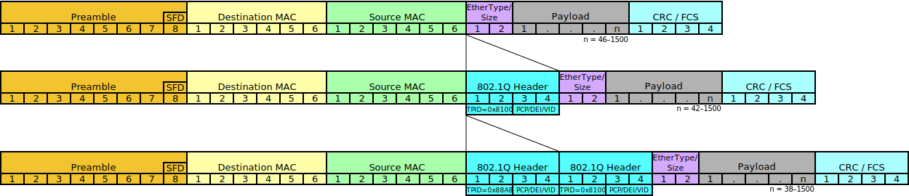
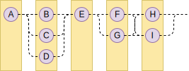

<p align="center"><h3 align="center">

The Dogma Metalanguage
======================

_Describing how things should be_

**Version**: 1.0-beta6


---------------------------------------------------------------------------------------------------

Dogma is a human-friendly metalanguage for describing data formats (text or binary) in documentation.

Dogma follows the familiar patterns of [Backus-Naur Form](https://en.wikipedia.org/wiki/Backus%E2%80%93Naur_form), with a number of innovations that make it also suitable for describing binary data.

---------------------------------------------------------------------------------------------------


## WORK IN PROGRESS

Current status: 1.0-beta6 (Apr 12, 2023).

Notable changes:

- Allow `numbers` type for bit counts in some functions.
- Allow name shadowing.
- Added `charsets` standard header.
- `bits` type can now be compared using less than and greater than.
- Removed variadic functions. Combine unicode categories using alternation instead.
- Revamped type system description.


Introductory Example
--------------------

To demonstrate the power of Dogma, here is an Ethernet IEEE 802.3 frame, layer 2 (image from [Wikipedia](https://en.wikipedia.org/wiki/IEEE_802.1Q)):



```dogma
dogma_v1 utf-8
- identifier  = 802.3_layer2
- description = IEEE 802.3 Ethernet frame, layer 2
- note        = Words are byte-ordered big endian, but every octet is sent LSB first.

frame             = preamble
                  & frame_start
                  & dst_address
                  & src_address
                  & var(etype, ether_type)
                  & [
                      etype.type = 0x8100: dot1q_frame;
                      etype.type = 0x88a8: double_tag_frame;
                                         : payload_by_type(etype.type, 46);
                    ]
                  & frame_check
                  ;
preamble          = uint(8, 0b01010101){7};
frame_start       = uint(8, 0b11010101);
dst_address       = uint(48, ~);
src_address       = uint(48, ~);
ether_type        = uint(16, var(type, ~));
frame_check       = uint(32, ~);

dot1q_frame       = tag_control_info
                  & var(etype, ether_type)
                  & payload_by_type(etype.type, 42)
                  ;
double_tag_frame  = service_tag
                  & uint(16, 0x8100)
                  & customer_tag
                  & var(etype, ether_type)
                  & payload_by_type(etype.type, 38)
                  ;

tag_control_info  = priority & drop_eligible & vlan_id;
priority          = uint(3, ~);
drop_eligible     = uint(1, ~);
vlan_id           = uint(12, ~);
service_tag       = tag_control_info;
customer_tag      = tag_control_info;

payload_by_type(type, min_size) = [
                                    type >= min_size & type <= 1500: generic_payload(type);
                                    type = 0x0800                  : ipv4;
                                    type = 0x86dd                  : ipv6;
                                    # Other types omitted for brevity
                                  ];
generic_payload(length)         = uint(8,~){length};
ipv4: bits                      = """https://somewhere/ipv4.dogma""";
ipv6: bits                      = """https://somewhere/ipv6.dogma""";
```

**See also**: [more examples](examples)


Contents
--------

- [The Dogma Metalanguage](#the-dogma-metalanguage)
  - [WORK IN PROGRESS](#work-in-progress)
  - [Introductory Example](#introductory-example)
  - [Contents](#contents)
  - [Design Objectives](#design-objectives)
    - [Human readability](#human-readability)
    - [Expressiveness](#expressiveness)
    - [Character set support](#character-set-support)
    - [Future proof](#future-proof)
  - [Forward Notes](#forward-notes)
    - [Versioning](#versioning)
    - [Informal Dogma in Descriptions](#informal-dogma-in-descriptions)
    - [Unicode Equivalence and Normalization](#unicode-equivalence-and-normalization)
  - [Concepts](#concepts)
    - [Non-Greedy Matching](#non-greedy-matching)
    - [Character Sets](#character-sets)
    - [Bit Ordering](#bit-ordering)
    - [Byte Ordering](#byte-ordering)
      - [Codepoint Byte Ordering](#codepoint-byte-ordering)
    - [Namespaces](#namespaces)
  - [Grammar Document](#grammar-document)
    - [Document Header](#document-header)
      - [Standard Headers](#standard-headers)
  - [Rules](#rules)
    - [Start Rule](#start-rule)
    - [Symbol](#symbol)
    - [Macro](#macro)
    - [Function](#function)
      - [Function Parameter and Return Types](#function-parameter-and-return-types)
  - [Types](#types)
    - [Bit](#bit)
    - [Bits](#bits)
    - [Bitseq](#bitseq)
    - [Boolean](#boolean)
    - [Condition](#condition)
    - [Expression](#expression)
    - [Nothing](#nothing)
    - [Number](#number)
    - [Numbers](#numbers)
    - [OOB](#oob)
    - [Ordering](#ordering)
    - [Unicode Categories](#unicode-categories)
  - [Variables](#variables)
  - [Literals](#literals)
    - [Numeric Literal](#numeric-literal)
    - [Codepoint Literal](#codepoint-literal)
      - [String Literal](#string-literal)
    - [Escape Sequence](#escape-sequence)
      - [Codepoint Escape](#codepoint-escape)
    - [Prose](#prose)
  - [Operations](#operations)
    - [Comparison](#comparison)
    - [Logic](#logic)
    - [Calculation](#calculation)
    - [Combination](#combination)
      - [Concatenation](#concatenation)
      - [Alternative](#alternative)
      - [Exclusion](#exclusion)
      - [Repetition](#repetition)
    - [Switch](#switch)
  - [Grouping](#grouping)
  - [Range](#range)
  - [Comment](#comment)
  - [Builtin Functions](#builtin-functions)
    - [`sized` Function](#sized-function)
    - [`aligned` Function](#aligned-function)
    - [`reversed` Function](#reversed-function)
    - [`ordered` function](#ordered-function)
    - [`byte_order` Function](#byte_order-function)
    - [`bom_ordered` Function](#bom_ordered-function)
    - [`peek` Function](#peek-function)
    - [`offset` Function](#offset-function)
    - [`var` Function](#var-function)
    - [`eod` Function](#eod-function)
    - [`unicode` Function](#unicode-function)
    - [`uint` Function](#uint-function)
    - [`sint` Function](#sint-function)
    - [`float` Function](#float-function)
    - [`inf` Function](#inf-function)
    - [`nan` Function](#nan-function)
    - [`nzero` Function](#nzero-function)
  - [Dogma described as Dogma](#dogma-described-as-dogma)


Design Objectives
-----------------

### Human readability

Although Dogma is parser-friendly, its primary purpose is for documentation. It must therefore be easy for a human to read and write, and must favor recognizable patterns over special case notation (which is harder to remember).

Whitespace _never_ has any semantic meaning in Dogma. It serves purely for token separation and for grammar aesthetics.

### Expressiveness

Binary formats tend to be structured in much more complex ways than text formats in order to optimize for speed, throughput, and ease-of-processing.

Dogma can describe data down to the bit level, and includes a number of [built-in functions](#builtin-functions) to help with complex data matching tasks.

[Calculations](#calculation) aid with length and offset fields, and optional/variable-sized structures can be [conditionally](#condition) parsed. Parsing can also "branch" temporarily to another part of the document (useful for directory-payload style formats).

[Variables](#variables) and [macros](#macro) offer a limited but balanced way for passing (immutable) context around.

### Character set support

Dogma can be used with any character set. Most codepoints can be directly input, and troublesome codepoints can be represented through [escape sequences](#escape-sequence).

Unicode characters can be selected by their [Unicode category](https://unicode.org/glossary/#general_category).

### Future proof

No specification is perfect, nor can it stand the test of time. Eventually an incompatible change will become necessary in order to stay relevant.

Every Dogma document records the Dogma specification version it was built against so that changes can be made to the specification without breaking existing grammars and tooling.


Forward Notes
-------------

### Versioning

Versioning for the Dogma specification is done in the form `major`.`minor`:

* Incrementing the major version signals a change in functionality (adding, removing, changing behavior).
* Incrementing the minor version signals non-functional changes like clarifications or rewording or bug fixes.

**For example**:

* Version 1.0: First public release
* Version 1.1: Clarification: z-ray is just as good as x-ray vision. In fact it's better; it's two more than x!
* Version 1.2: Changed the wording of section 2.2 to make its intended use and limitations more clear.
* Version 2.0: Added new type "y-ray" for the undecided.

**In this repository**:

* Each `dogma_vX.md` file is the evolving document for this major release, with any unreleased changes.
* Each `dogma_vX.Y.md` file is the immutable document for this particular major.minor release.


### Informal Dogma in Descriptions

Section descriptions in this specification will usually include some "informal" Dogma notation (where structural tokens such as those for whitespace are omitted for clarity). When in doubt, please refer to the [formal Dogma grammar at the end of this document](#dogma-described-as-dogma).


### Unicode Equivalence and Normalization

By default only the exact, as-entered, non-processed (i.e. not normalized) codepoints present in a Unicode expression will be matched. For more advanced matching, define [functions](#function) that apply normalization preprocessing or produce equivalence [alternatives](#alternative) to a string expression.


Concepts
--------

### Non-Greedy Matching

All [bits](#bits) matching is assumed to be non-greedy.

For example, given the following grammar:

```dogma
document  = record+ & '@';
record    = letter+ & terminator;
letter    = 'a'~'z';
terminaor = "zzz";
```

Given the document `azzzbzzzczzz@`, The above Dogma would match 3 records (`a`, `b`, and `c`), not one record (`azzzbzzzc`).


### Character Sets

Dogma can be used with any [character set](https://www.iana.org/assignments/character-sets/character-sets.xhtml).

By default, it is assumed that the format being described by a dogma document uses the same character set as [the Dogma document is written in](#document-header). However, if the [`charsets` header line](#standard-headers) is provided, then only the character sets listed in that header line are valid (how a particular character set is chosen from that list must be specified elsewhere, and is beyond the scope of this specification).

If allowed characters in a grammar cannot be 1:1 converted between the [grammar document's character set](#document-header) and the character sets listed in the [`charsets` header line](#standard-headers), then the conversion method(s) must be specified elsewhere (which is beyond the scope of this specification).

**Note**: [Character set names](https://www.iana.org/assignments/character-sets/character-sets.xhtml) are case-insensitive, but it's customary to use all lowercase.


### Bit Ordering

Bit ordering is assumed to be "most significant bit first" since it is almost always abstracted that way by the hardware, and ordering generally only comes into play when actually transmitting data serially (which is outside of the scope of Dogma).

Bit ordering can be manipulated on a smaller scale using the [`reversed` function](#reversed-function). For example:

| Expression                                  | Matches bits        | Notes                                              |
| ------------------------------------------- | ------------------- | -------------------------------------------------- |
| `uint(16,0x5bbc)`                           | `01011011 10111100` | BE _byte_ order, BE _bit_ order (ABCDEFGHIJKLMNOP) |
| `reversed(8, uint(16,0x5bbc))`              | `10111100 01011011` | LE _byte_ order, BE _bit_ order (IJKLMNOPABCDEFGH) |
| `reversed(8, reversed(1, uint(16,0x5bbc)))` | `11011010 00111101` | BE _byte_ order, LE _bit_ order (HGFEDCBAPONMLKJI) |
| `reversed(1, uint(16,0x5bbc))`              | `00111101 11011010` | LE _byte_ order, LE _bit_ order (PONMLKJIHGFEDCBA) |
| `reversed(2, uint(16,0x5bbc))`              | `00111110 11100101` | 2-bit granularity reversed (OPMNKLIJGHEFCDAB)      |


### Byte Ordering

Because some data formats store endianness information in the data itself, byte ordering needs to be selectable while parsing.

Byte ordering can be `msb` (most significant byte first) or `lsb` (least significant byte first), and only comes into effect for expressions passed to an [`ordered` function](#ordered-function) call. Outside of this context, all non-codepoint multibyte data is assumed to be `msb`.

The global byte ordering is `msb`, and can be changed for the duration of a subexpression passed to the [`byte_order` function](#byte_order-function).

#### Codepoint Byte Ordering

All [codepoints](#codepoint-literal) follow the [character set's](#character-sets) byte order rules and ignore the [byte order](#byte-ordering) setting. For example, `utf-16le` is always interpreted "least significant byte first", even when the [byte order](#byte-ordering) is set to `msb`. Similarly, `utf-16be` is always interpreted "most significant byte first".

**Note**: Dogma cannot make assumptions about where the "beginning" of a text stream is for [byte-order mark (BOM)](https://en.wikipedia.org/wiki/Byte_order_mark) purposes. If you wish to support BOM-based byte ordering, use the [`bom_ordered` function](#bom_ordered-function).


### Namespaces

All [symbols](#symbol), [macros](#macro), [functions](#function) and [variables](#variables) have names that are part of a namespace. All names are case sensitive and must be unique to their namespace.

The global namespace consists of all [rule](#rules) names, enumerated type names (from [`ordering`](#ordering) and [`unicode_categories`](#unicode-categories)), and the names of the [built-in functions](#builtin-functions).

Each [rule](#rules) has a local namespace that supercedes the global namespace (i.e. the local namespace is searched first, then the global namespace - meaning that a local variable name can shadow a global name). [Variables](#variables) can be bound to the local namespace either via [macro arguments](#macro) or using the [`var` function](#var-function).

**Note**: Names cannot be re-bound.


Grammar Document
----------------

A Dogma grammar document begins with a [header section](#document-header), followed by a [start rule](#start-rule) and possibly more [rules](#rules).

```dogma
document = document_header & start_rule & rule*;
```


### Document Header

The document header identifies the file format as Dogma, and contains the following mandatory information:

* The major version of the Dogma specification that the document adheres to.
* The case-insensitive name of the [character encoding](https://www.iana.org/assignments/character-sets/character-sets.xhtml) that the Dogma document is written in.

Optionally, the header section may also include header lines. An empty line terminates the document header section.

```dogma
document_header    = "dogma_v" & dogma_major_version & SOME_WS & character_encoding & LINE_END
                   & (header_line & LINE_END)*
                   & LINE_END
                   ;
character_encoding = ('a'~'z' | 'A'~'Z' | '0'~'9' | '_' | '-' | '.' | ':' | '+' | '(' | ')')+;
header_line        = '-' & SOME_WS & header_name & '=' & header_value;
header_name        = standard_header_names | (printable ! '=')+;
header_value       = printable_ws+;
```

#### Standard Headers

The following headers are officially recognized (all others are allowed, but are not standardized):

* `charsets`: A case-insensitive comma-separated (plus possible whitespace) list of the [character sets](#character-sets) that are supported by the format being described.
* `description`: A brief, one-line description of the grammar.
* `dogma`: A pointer to the Dogma specification as a courtesy to readers.
* `identifier`: A unique identifier for the grammar being described. It's customary to append a version number to the identifier.
* `reference`: A pointer to the official specification for the data format being described.

-------------------------------------------------------------------------------
**Example**: A UTF-8 Dogma grammar called "mygrammar_v1".

```dogma
dogma_v1 utf-8
- identifier  = myformat_v1
- description = Grammar for myformat, version 1
- reference   = https://myformat.org/specification
- dogma       = https://github.com/kstenerud/dogma/blob/master/v1/dogma_v1.0.md

document = "a"; # It's a very simple format ;-)
```
-------------------------------------------------------------------------------


Rules
-----

Rules specify the restrictions on how terminals can be combined into a valid sequence. A rule can define a [symbol](#symbol), a [macro](#macro), or a [function](#function), and can work with or produce any of the standard [types](#types).

Rules are written in the form `nonterminal = expression;`, with optional whitespace (including newlines) between rule elements.

```dogma
rule              = symbol_rule(expr_any) | macro_rule | function_rule;
start_rule        = symbol_rule(expr_bits);
symbol_rule(expr) = symbol & '=' & expr & ';';
macro_rule        = macro & '=' & expr_any & ';';
function_rule     = function & '=' & prose & ';';
```

The left part of a rule can define a [symbol](#symbol), a [macro](#macro), or a [function](#function). Their case-sensitive identifiers (names) share the same global [namespace](#namespaces).

```dogma
symbol               = identifier_global;
macro                = identifier_global & PARENTHESIZED(param_name & (',' & param_name)*);
param_name           = identifier_local;
function             = function_no_args | function_with_args;
function_no_args     = identifier_global & type_specifier;
function_with_args   = identifier_global
                     & PARENTHESIZED(function_param & (',' & function_param)*)
                     & type_specifier
                     ;
function_param       = param_name & type_specifier;
type_specifier       = ':' & type_name;

identifier_any       = name;
identifier_local     = identifier_any;
identifier_global    = identifier_any ! reserved_identifiers;
reserved_identifiers = builtin_function_names | enumeration_names;

name                 = name_firstchar & name_nextchar*;
name_firstchar       = unicode(L|M);
name_nextchar        = name_firstchar | unicode(N) | '_';
```

The general convention is to use all uppercase names for "background-y" things like whitespace and separators and other structural components, which makes them easier for a human to gloss over (see [the Dogma grammar document](#dogma-described-as-dogma) as an example).

**Note**: Whitespace in a Dogma rule is only used to separate tokens and for visual layout purposes; it does not imply any semantic meaning.


### Start Rule

The first rule listed in a Dogma document is the start rule (where parsing of the format begins). Only a [symbol](#symbol) that produces [bits](#bits) can be a start rule.


### Symbol

A symbol acts as a placeholder for something ([bits](#bits), [numbers](#numbers), [conditions](#condition)) to be substituted in another rule.

```dogma
symbol_rule(expr) = symbol & '=' & expr & ';';
symbol            = identifier_global;
```

**Note**: Symbol names are not limited to ASCII.

-------------------------------------------------------------------------------
**Example**: A record consists of a company name, followed by two full-width colons, followed by an employee count in full-width characters (possibly approximated to the nearest 10,000), and is terminated by a linefeed.

```dogma
記録	= 会社名 & "：：" & 従業員数 & LF;
会社名	= unicode(L|M) & unicode(L|M|N|P|S|Zs)*;
従業員数	= '１'~'９' & '０'~'９'* & '万'?;
LF	= '\[a]';
```

`記録`, `会社名`, `従業員数`, and `LF` are symbols.

Or if you prefer, the same thing with English symbol names:

```dogma
record         = company_name & "：：" & employee_count & LF;
company_name   = unicode(L|M) & unicode(L|M|N|P|S|Zs)*;
employee_count = '１'~'９' & '０'~'９'* & '万'?;
LF             = '\[a]';
```

`record`, `company_name`, `employee_count`, and `LF` are symbols.

-------------------------------------------------------------------------------


### Macro

A macro is essentially a [symbol](#symbol) that accepts parameters, which are bound to local [variables](#variables) for use within the macro's [namespace](#namespaces). The macro's contents are written in the same manner as [symbol](#symbol) rules, but also have access to the injected local variables.

```dogma
macro_rule = macro & '=' & expr_any & ';';
macro      = identifier_global & PARENTHESIZED(param_name & (',' & param_name)*);
```

When called, a macro substitutes the passed-in parameters and then proceeds like a symbol rule would. Parameter and return [types](#types) are inferred based on how the parameters are used within the macro, and the type resulting from the macro's expression. The grammar is malformed if a macro is called with incompatible types, or is used in a context that is incompatible with its return type.

```dogma
call       = identifier_any & PARENTHESIZED(call_param & (',' & call_param)*);
call_param = expr_any;
```

-------------------------------------------------------------------------------
**Example**: The main section consists of three records: A type 1 record and two type 2 records. A record begins with a type byte, followed by a length byte, followed by that many bytes of data.

```dogma
main_section = record(1) & record(2){2};
record(type) = byte(type) & byte(var(length, ~)) & byte(~){length};
byte(v)      = uint(8,v);
```

In the above example, `record` will only produce meaningful results when called with unsigned integer values, because the `type` field is passed to the `byte` macro, which calls the [`uint` function](#uint-function), which expects a [`uintegers`](#numbers) parameter.

**Example**: An [IPV4](https://en.wikipedia.org/wiki/Internet_Protocol_version_4) packet contains "header length" and "total length" fields, which together determine how big the "options" and "payload" sections are. "protocol" determines the protocol of the payload.

```dogma
ip_packet                    = # ...
                             & uint(4,var(header_length, 5~)) # header length in 32-bit words
                               # ...
                             & uint(16,var(total_length, 20~)) # total length in bytes
                               # ...
                             & uint(8,var(protocol, registered_protocol))
                               # ...
                             & options((header_length-5) * 32)
                             & payload(protocol, (total_length-(header_length*4)) * 8)
                             ;

options(bit_count)           = sized(bit_count, option*);
option                       = option_eool
                             | option_nop
                             # | ...
                             ;

payload(protocol, bit_count) = sized(bit_count, payload_contents(protocol) & uint(1,0)*);
payload_contents(protocol)   = [
                                 protocol = 0: protocol_hopopt;
                                 protocol = 1: protocol_icmp;
                                 # ...
                               ];
```
-------------------------------------------------------------------------------


### Function

Functions behave similarly to macros, except that they are opaque: whereas a macro is defined within the bounds of the grammatical notation, a function's procedure is user-defined in [prose](#prose) (as a description, or as a URL pointing to a description).

Functions that take no parameters are defined and called without the trailing parentheses (similar to defining or calling a [symbol](#symbol)).

**Note**: Dogma pre-defines a number of essential [built-in functions](#builtin-functions).

#### Function Parameter and Return Types

Since functions are opaque, their parameter and return [types](#types) cannot be automatically deduced like they can for [macros](#macro). Functions therefore declare all parameter and return [types](#types). If a function is called with the wrong types or its return value is used in an incompatible context, the grammar is malformed.

```dogma
function_rule      = function & '=' & prose & ';';
function           = function_no_args | function_with_args;
function_no_args   = identifier_global & type_specifier;
function_with_args = identifier_global
                   & PARENTHESIZED(function_param & (',' & function_param)*)
                   & type_specifier
                   ;
function_param     = param_name & type_specifier;
type_specifier     = ':' & type_name;
type_name          = "bits"
                   | "condition"
                   | "expression"
                   | "nothing"
                   | "number"
                   | "numbers"
                   | "oob"
                   | "ordering"
                   | "sinteger"
                   | "sintegers"
                   | "uinteger"
                   | "uintegers"
                   | "unicode_categories"
                   ;
```

-------------------------------------------------------------------------------
**Example**: A function to convert an unsigned int to its unsigned little endian base 128 representation.

```dogma
uleb128(v: uinteger): bits = """https://en.wikipedia.org/wiki/LEB128#Unsigned_LEB128""";
```

**Example**: A record contains an ISO 8601 encoded date, then an equals sign, followed by a temperature reading.

```dogma
record         = iso8601 & '=' & temperature;
iso8601: bits  = """https://en.wikipedia.org/wiki/ISO_8601#Combined_date_and_time_representations""";
temperature    = digit+ & ('.' & digit+)?;
digit          = '0'~'9';
```

**Example**: The [unicode function](#unicode-function) can accept any number of Unicode categories.

```dogma
unicode(categories: unicode_categories): bits =
    """
    Creates an expression containing the alternatives set of all Unicode codepoints that have any
    of the given Unicode categories.
    """
```
-------------------------------------------------------------------------------


Types
-----

Dogma's types come in five broad compositional categories:

| Category         | Description                                                                                               |
| ---------------- | --------------------------------------------------------------------------------------------------------- |
| Enumeration      | A type with a limited number of named values.                                                             |
| Scalar           | A singular value.                                                                                         |
| Sequence         | A sequence of same-type elements that together make up a composite object.                                |
| Set              | A set of possible values that will realize into a scalar or sequence when parsing a document.             |
| Sequence of Sets | A sequence of sets of possibilities that will realize into a sequence of scalars when parsing a document. |

The "sequence of sets" can be visualized as a railroad diagram, where each yellow rectangle in the sequence contains a set of value alternatives:



The above diagram represents all possible combinations of `A & (B|C|D) & E & (F|G) & (H|I)`.

The following types are used by the Dogma language:

| Name                 | Composition                      | Realizes To       | Direct Input |
| -------------------- | -------------------------------- | ----------------- | ------------ |
| `bit`                | scalar                           |                   | ❌           |
| `bits`               | sequence of sets of `bit`        | `bitseq`          | ✔️            |
| `bitseq`             | sequence of `bit`                |                   | ❌           |
| `boolean`            | scalar                           |                   | ❌           |
| `condition`          | sequence of sets of `boolean`    | `boolean`         | ✔️            |
| `expression`         | see below                        |                   | ✔️            |
| `nothing`            |                                  |                   | ❌           |
| `number`             | scalar                           |                   | ✔️            |
| `numbers`            | set of `number`                  | `number`          | ✔️            |
| `oob`                | out-of-band                      |                   | ❌           |
| `ordering`           | enumeration                      |                   | ✔️            |
| `unicode_categories` | set of enumerations              | `bitseq`          | ✔️            |

Some types can be directly input into a Dogma grammar, while others are produced indirectly when processing a document.

Types become relevant in certain contexts, particularly when calling [functions](#function) (which have restrictions on what types they accept and return).

Certain types realize into more basic types when matching a document. For example, the `bits` type `'a'~'z'{3}` allows any three lowercase English letters. Parsing a document containing "abc" will realize the `bitseq` type `"abc"` from the `bits` type `'a'~'z'{3}`. If you were to capture this into a [variable](#variables) such as `var(myvar,'a'~'z'{3})`, you'd end up with a variable called `myvar` of type `bitseq` containing `"abc"`.

Some of the more basic types can be promoted to complex types if their ultimate base types match:

* A lone `bitseq` is treated as a sequence of unit sets when passed to a `bits` context.
* A lone `number` is treated as a unit set when passed to a `numbers` context.
* A lone `boolean` is treated as a single-entry sequence of a unit set when passed to a `condition` context.


### Bit

The `bit` type represents a single [BInary digiT](https://en.wikipedia.org/wiki/Bit).

`bit` exists for illustrative purposes only, and is not directly usable (`uint(1,0)` is actually type [`bits`](#bits) containing one set of one bit, which during parsing realizes to type [`bitseq`](#bitseq) containing one bit element).


### Bits

The `bits` type represents a _sequence of sets_ of type `bitseq` that can be matched in a document. Upon matching, `bits` realizes into [`bitseq`](#bitseq).

Bits are produced by [codepoints](#codepoint-literal), [strings](#string-literal), and [some functions](#builtin-functions), which can then be constructed into sequences of sets using using [alternatives](#alternative), [concatenation](#concatenation), [repetition](#repetition), and [exclusion](#exclusion).

-------------------------------------------------------------------------------
**Example**: A timestamp is a 64-bit unsigned integer, with each time field stored as a separate bitfield.

Bit fields (from high bit to low bit):

| Field       | Bits | Min | Max    |
| ----------- | ---- | --- | ------ |
| Year        | 18   | 0   | 262143 |
| Month       | 4    | 1   | 12     |
| Day         | 5    | 1   | 31     |
| Hour        | 5    | 0   | 23     |
| Minute      | 6    | 0   | 59     |
| Second      | 6    | 0   | 60     |
| Microsecond | 20   | 0   | 999999 |

```dogma
timestamp   = year & month & day & hour & minute & second & microsecond;
year        = uint(18, ~);
month       = uint(4, 1~12);
day         = uint(5, 1~31);
hour        = uint(5, 0~23);
minute      = uint(6, 0~59);
second      = uint(6, 0~60); # Mustn't forget leap seconds!
microsecond = uint(20, 0~999999);
```
-------------------------------------------------------------------------------


### Bitseq

The `bitseq` type represents a sequence of type `bit`. This type results from matching [`bits`](#bits) in a document, and can be captured to a variable using the [`var` function](#var-function).

For example, `("a" | "i") & "t"` (type `bits`) can realize into either the `bitseq` "at" (`110000101110100`) or "it" (`110100101110100`).

**Note**: Type `bitseq` is treated as `bits` (such that each element is a set of size 1) when passed to a context requiring type `bits`.


### Boolean

The `boolean` type has two possible values: true or false. Booleans cannot be directly input as literals, but are instead produced through [comparisons](#comparison).


### Condition

The `condition` type represents a _sequence of sets_ of type [`boolean`](#boolean). Upon evaluation, `condition` realizes into a single `boolean`.

Conditions are produced by [comparisons](#comparison), and [logical operations](#logic) upon conditions.

Conditions are used in [switches](#switch), and can be [grouped](#grouping).

-------------------------------------------------------------------------------
**Examples**:

* `type = 2`
* `(value >= 3 & value < 10) | value = 0`
* `(x > 3 & y > 5) | x * y > 15`
* `nextchar != 'a'`
-------------------------------------------------------------------------------


### Expression

`expression` represents an expression as a whole, including all type information and metadata associated with it. This is used in the [`var` function](#var-function).


### Nothing

Used as a return type for functions that don't produce anything to match at the current location, but instead peek or process data elsewhere in the document (such as the [`peek` function](#peek-function) and [`offset` function](#offset-function)).


### Number

The `number` type represents a mathematical real (not a computer floating point value, which is an implementation detail). `number` can be used in [calculations](#calculation), numeric [ranges](#range), [repetition](#repetition), and as parameters to or return types from [functions](#function). `number` can also be converted to [bits](#bits) using [functions](#function) such as [float](#float-function), [sint](#sint-function), and [uint](#uint-function).

Numbers can be expressed as [numeric literals](#numeric-literal), or derived from [functions](#function), [variables](#variables), and [calculations](#calculation).

The two most common numeric invariants are supported natively as pseudo-types:

* The `sinteger` (signed integer) pseudo-type restricts values to positive and negative integers, and 0.
* The `uinteger` (unsigned integer) pseudo-type restricts values to positive integers and 0.

These pseudo-types only place restrictions on the final realized value; they are still `number` types and behave like mathematical reals for all operations, with the destination invariant type (such as a [function](#function) parameter's type) restricting what resulting values are allowed.

**Note**: A value that breaks an invariant on a `number` (the singular `number` type, not the set [`numbers`](#numbers) type) indicates a malformed document or grammar.


### Numbers

The `numbers` type (and associated pseudo-type invariants `sintegers` and `uintegers`) represents sets of type [`number`](#number). Number sets are commonly used in [repetition](#repetition), or passed as arguments to certain [functions](#builtin-functions) (such as [sint](#sint-function), [uint](#uint-function), [float](#float-function)) to produce [`bits`](#bits).

Number sets are produced using [ranges](#range), [alternatives](#alternative), and [exclusion](#exclusion).

**Note**: Any value in a `numbers` set that breaks an invariant is silently removed from the set (this is _not_ considered an error). For example `-1.5~1.5` passed to a `sintegers` invariant will be reduced to the set of integer values (-1, 0, 1). `0.5~0.6` passed to a `sintegers` invariant will be reduced to the empty set. `-5` passed to a `uintegers` invariant will be reduced to the empty set.

-------------------------------------------------------------------------------
**Examples**:

* `1 | 5 | 30`: The set of numbers 1, 5, and 30.
* `1~3`: All numbers from 1 to 3. If passed to an integer context, this would be equivalent to `1 | 2 | 3`.
* `1~300 ! 15`: All numbers from 1 to 300, except for 15.
* `(1~low | high~900) ! 200~600`: All numbers from 1 to the `low` variable or from the `high` variable to 900, except for anything from 200 to 600.
-------------------------------------------------------------------------------


### OOB

`oob` (out-of-band) is used for special-case matching situations that rely upon signals from outside of the parsed document's data, such as the [`eod` function](#eod-function).


### Ordering

The `ordering` type specifies the [byte ordering](#byte-ordering) when processing expressions in certain contexts. This type supports two values:

* `msb` = Most significant byte first
* `lsb` = Least significant byte first

-------------------------------------------------------------------------------
**Example**: A document consists of a header containing length fields and a media type, followed by an opaque payload (a series of bytes) containing media of that type. Byte order in the header is little endian.

The [`byte_order` function](#byte_order-function) sets the byte ordering to `lsb` (little endian) for the `header` expression.

The `u16` and `u32` macros call the [`ordered` function](#ordered-function), which arranges the byte order according to the current setting (`lsb`, passed down via the `document` rule). Note that this has no effect on the media type bytes because it doesn't call `ordered`.

```dogma
document        = byte_order(lsb, header) & payload;
header          = u16(var(header_length, 2~))
                & u32(var(payload_length, 2~))
                & u8(var(media_type_length, ~))
                & var(media_type, uint(8,~){media_type_length})
                ;
payload(length) = u8(~){length};
u8(values)      = uint(8,values);
u16(values)     = ordered(uint(16,values));
u32(values)     = ordered(uint(32,values));
```
-------------------------------------------------------------------------------


### Unicode Categories

The `unicode_categories` type specifies the set of [Unicode categories](https://www.unicode.org/versions/Unicode15.0.0/ch04.pdf#G134153) whose codepoints to select from the Unicode character set (see the [`unicode` function](#unicode-function)).

Categories are combined using [alternatives notation](#alternative).

| Category | Description             | Category | Description                | Category | Description          |
| -------- | ----------------------- | -------- | -------------------------- | -------- | -------------------- |
| L        | Letter                  | No       | Number, other              | Sk       | Symbol, modifier     |
| Lu       | Letter, uppercase       | P        | Punctuation                | So       | Symbol, other        |
| Ll       | Letter, lowercase       | Pc       | Punctuation, connector     | Z        | Separator            |
| Lt       | Letter, titlecase       | Pd       | Punctuation, dash          | Zs       | Separator, space     |
| Lm       | Letter, modifier        | Ps       | Punctuation, open          | Zl       | Separator, line      |
| Lo       | Letter, other           | Pe       | Punctuation, close         | Zp       | Separator, paragraph |
| M        | Mark                    | Pi       | Punctuation, initial quote | C        | Other                |
| Mn       | Mark, nonspacing        | Pf       | Punctuation, final quote   | Cc       | Other, control       |
| Mc       | Mark, spacing combining | Po       | Punctuation, other         | Cf       | Other, format        |
| Me       | Mark, enclosing         | S        | Symbol                     | Cs       | Other, surrogate     |
| N        | Number                  | Sm       | Symbol, math               | Co       | Other, private use   |
| Nd       | Number, decimal digit   | Sc       | Symbol, currency           | Cn       | Other, not assigned  |
| Nl       | Number, letter          |          |                            |          |                      |

-------------------------------------------------------------------------------
**Examples**:

```dogma
alphanumeric           = unicode(L|N);
alphanumeric_uppercase = unicode(Lu|N);
name_field             = unicode(L|M|N|P|S){1~100};
```
-------------------------------------------------------------------------------


Variables
---------

In some contexts, values can be bound to a variable for use in the current [namespace](#namespaces). Variables are bound either manually using the [`var`](#var-function) builtin function, or automatically when passing parameters to a [macro](#macro). The variable's [type](#types) is inferred from its provenance and where it is ultimately used (a type mismatch indicates a malformed grammar).

**Note**: Variables cannot be re-bound.

When [making a variable](#var-function) of an expression that already contains variable(s), that expression's bound variables are accessible from the outer scope using dot notation (`this_expr_variable.sub_expr_variable`).

-------------------------------------------------------------------------------
**Example**: An IEEE 802.3 Ethernet layer 2 frame contains a type field that determines what kind of payload and extra metadata it contains.

We capture the `ether_type` symbol into variable `etype` using the [`var` function](#var-function). Since `ether_type` already captures its own (numeric) variable `type`, we can use dot notation to access it (`etype.type`), and then use that in a [switch statement](#switch) or pass it to a [macro](#macro) or [function](#function).

```dogma
frame       = preamble
            & frame_start
            & dst_address
            & src_address
            & var(etype, ether_type)
            & [
                etype.type = 0x8100: dot1q_frame;
                etype.type = 0x88a8: double_tag_frame;
                                   : payload_by_type(etype.type, 46);
              ]
            & frame_check
            ;
preamble    = uint(8, 0b01010101){7};
frame_start = uint(8, 0b11010101);
dst_address = uint(48, ~);
src_address = uint(48, ~);
ether_type  = uint(16, var(type, ~));
frame_check = uint(32, ~);
...
```
See [full example here](examples/802.3_layer2.dogma).

-------------------------------------------------------------------------------


Literals
--------

### Numeric Literal

Numeric literals can be expressed in many ways:

* Integers can be expressed in binary, octal, decimal, or hexadecimal notation.
* Reals can be expressed in decimal or hexadecimal notation.

**Notes**:

* Decimal real notation translates more cleanly to decimal float encodings such as [ieee754 decimal](https://en.wikipedia.org/wiki/Decimal64_floating-point_format).
* Hexadecimal real notation translates more cleanly to binary float encodings such as [ieee754 binary](https://en.wikipedia.org/wiki/Double-precision_floating-point_format).
* Conversions from literal reals to floating point encodings that differ in base are assumed to follow the generally accepted algorithms for such conversions (e.g. `Grisu`, `std::strtod`).

```dogma
number_literal       = int_literal_bin | int_literal_oct | int_real_literal_dec | int_real_literal_hex;
int_real_literal_dec = neg? digit_dec+
                     & ('.' & digit_dec+ & (('e' | 'E') ('+' | '-')? & digit_dec+)?)?
                     ;
int_real_literal_hex = neg? & '0' & ('x' | 'X') & digit_hex+
                     & ('.' & digit_hex+ & (('p' | 'P') & ('+' | '-')? & digit_dec+)?)?
                     ;
int_literal_bin      = neg? & '0' & ('b' | 'B') & digit_bin+;
int_literal_oct      = neg? & '0' & ('o' | 'O') & digit_oct+;
neg                  = '-';
```

-------------------------------------------------------------------------------
**Examples**:

```dogma
header_signature = uint(5, 0b10111);
ascii_char_8bit  = uint(8, 0x00~0x7f);
tolerance        = float(32, -1.5~1.5);
exact_float      = float(32, 0x5df1p-16);
```
-------------------------------------------------------------------------------


### Codepoint Literal

A codepoint is the [bits](#bits) representation of a character in a particular [encoding](https://en.wikipedia.org/wiki/Character_encoding). Codepoints can be represented as literals, [ranges](#range), and [category sets](#unicode-function).

Expressing codepoint literals as a [range](#range) causes every codepoint in the range to be added as an [alternative](#alternative).

Codepoint literals are placed between single or double quotes.

```dogma
codepoint_literal = '"' & maybe_escaped(printable_ws ! '"'){1} & '"'
                  | "'" & maybe_escaped(printable_ws ! "'"){1} & "'"
                  ;
```

-------------------------------------------------------------------------------
**Examples**:

```dogma
letter_a     = 'a';     # or "a"
a_to_c       = 'a'~'c'; # or "a"~"c", or 'a' | 'b' | 'c', or "a" | "b" | "c"
alphanumeric = unicode(L|N);
```
-------------------------------------------------------------------------------

#### String Literal

A string literal can be thought of as syntactic sugar for a series of specific [codepoint literals](#codepoint-literal) [concatenated](#concatenation) together.

String literals are placed between single or double quotes (the same as for single codepoint literals).

```dogma
string_literal = '"' & maybe_escaped(printable_ws ! '"'){2~} & '"'
               | "'" & maybe_escaped(printable_ws ! "'"){2~} & "'"
               ;
```

-------------------------------------------------------------------------------
**Example**: The following are all equivalent:

```dogma
str_abc_1 = "abc";
str_abc_2 = 'abc';
str_abc_3 = "a" & "b" & "c";
str_abc_4 = 'a' & 'b' & 'c';
```
-------------------------------------------------------------------------------


### Escape Sequence

[Codepoint literals](#codepoint-literal), [string literals](#string-literal), and [prose](#prose) may contain codepoint escape sequences to represent troublesome codepoints.

Escape sequences are initiated with the backslash (`\`) character. If the next character following is an open square brace (`[`), it begins a [codepoint escape](#codepoint-escape). Otherwise the escape sequence represents that literal character.

```dogma
escape_sequence = '\\' & (printable ! '[') | codepoint_escape);
```

-------------------------------------------------------------------------------
**Example**: A string containing double quotes.

```dogma
mystr = "This is a \"string\""; # or using single quotes: 'This is a "string"'
```
-------------------------------------------------------------------------------

#### Codepoint Escape

A codepoint escape interprets the hex digits between the sequence `\[` and `]` as the hexadecimal numeric value of the codepoint being referred to. What actual character and [bits](#bits) result from the codepoint escape depends on the [character set](#character-sets) being used.

```dogma
escape_sequence  = '\\' & (printable ! '[') | codepoint_escape);
codepoint_escape = '[' & digit_hex+ & ']';
```

-------------------------------------------------------------------------------
**Example**: Emoji

```dogma
mystr = "This is all just a bunch of \[1f415]ma!"; # "This is all just a bunch of 🐕ma!"
```
-------------------------------------------------------------------------------

### Prose

Prose describes a [function's](#function) invariants and implementation in natural language, or it may contain a URL pointing to another document.

Prose is placed between sets of three double or single quotes.

```dogma
prose = '"""' & (maybe_escaped(printable_wsl)+ ! '"""') & '"""'
      | "'''" & (maybe_escaped(printable_wsl)+ ! "'''") & "'''"
      ;
```

-------------------------------------------------------------------------------
**Example**: A record contains a date and temperature separated by `:`, followed by a newline, followed by a flowery description of any length in iambic pentameter (newlines allowed), terminated by `=====` on its own line.

```dogma
record              = date & ':' & temperature & LF & flowery_description & LF & '=====' & LF;
date                = """YYYY-MM-DD, per https://en.wikipedia.org/wiki/ISO_8601#Calendar_dates""";
temperature         = digit+ & ('.' & digit+)?;
digit               = '0'~'9';
flowery_description: bits = """
A poetic description of the weather, written in iambic pentameter. For example:

While barred clouds bloom the soft-dying day,
And touch the stubble-plains with rosy hue;
Then in a wailful choir the small gnats mourn
Among the river sallows, borne aloft
Or sinking as the light wind lives or dies.
""";
```
-------------------------------------------------------------------------------


Operations
----------

### Comparison

A comparison takes the form `<term1>` `<comparator>` `<term2>`, producing a [`boolean`](#boolean) when evaluated.

The following comparators are supported:

* Less than (`<`)
* Less than or equal to (`<=`)
* Equal to (`=`)
* Not equal to (`!=`)
* Greater than or equal to (`>=`)
* Greater than (`>`)

Comparisons can be made between two [`number`](#number) types (as well as invariants), or between two [`bitseq`](#bitseq) types (as well as `bits`, which will be compared once realized into `bitseq`).

```dogma
comparison = number & comparator & number
           | bitseq & comparator & bitseq
           ;
comparator = "<" | "<=" | "=" | "!=" | ">=" | ">";
```

**Notes**:

* [`bitseq`](#bitseq) can only be compared when both operands contain the same number of bits. If operands of differing bit counts are compared, the grammar is malformed.
* [`bitseq`](#bitseq) types are compared as if they were big endian encoded unsigned integers.

**Examples**:

* `9.1 < 10`: true
* `"a" < "z"`: true
* `"a" = "z"`: false
* `uint(4,9) >= uint(4,3)`: false
* `"a" < 0x100`: malformed grammar (mixed types `bitseq` and `number`)
* `"aa" = "z"`: malformed grammar (different number of bits)
* `uint(3,1) != uint(4,3)`: malformed grammar (different number of bits)


### Logic

Dogma supports combining [Conditions](#condition) into more complex forms using [logical operators](https://en.wikipedia.org/wiki/Logical_connective).

The following logical operations are supported (low to high relative precedence):

| Operator | Operation                    | Operands | Precedence |
| -------- | ---------------------------- | -------- | ---------- |
| `\|`     | "or" (inclusive disjunction) | binary   | 1 (low)    |
| `&`      | "and" (conjunction)          | binary   | 2          |
| `!`      | "not" (negation)             | unary    | 3 (high)   |

Logical operations can also be [grouped](#grouping).

```dogma
condition          = comparison | logical_op;
logical_op         = logical_or | logical_op_and_not;
logical_op_and_not = logical_and | logical_op_not;
logical_op_not     = logical_not | maybe_grouped(condition);
logical_or         = condition & '|' & condition;
logical_and        = condition & '&' & condition;
logical_not        = '!' & condition;
```

**Examples**:

* `a < b & c = d`
* `!(x < y | y < z) & a = b`


### Calculation

Calculations perform arithmetic operations on [numbers](#numbers), producing a new number. All operands are treated as mathematical reals for the purpose of the calculation.

The following arithmetic operations are supported (low to high relative precedence):

| Operator | Operation                           | Operands | Precedence |
| -------- | ----------------------------------- | -------- | ---------- |
| `+`      | Addition                            | binary   | 1 (low)    |
| `-`      | Subtraction                         | binary   | 1          |
| `*`      | Multiplication                      | binary   | 2          |
| `/`      | Division                            | binary   | 2          |
| `%`      | Modulus                             | binary   | 2          |
| `^`      | Power (`x^y` = x to the power of y) | binary   | 3          |
| `-`      | Negation                            | unary    | 4 (high)   |

**Notes**:

* Any operation giving a result that is mathematically undefined (such as division by zero) is undefined behavior. A grammar that allows undefined behavior to occur is ambiguous.
* [The modulo operation can produce two different values depending on how the remainder is derived](https://en.wikipedia.org/wiki/Modulo#Variants_of_the_definition). Modulo in Dogma uses truncated division (where the remainder has the same sign as the dividend), which is the most common approach used in popular programming languages.

```dogma
number       = calc_add | calc_sub | calc_mul_div;
calc_mul_div = calc_mul | calc_div | calc_mod | calc_pow_neg;
calc_pow_neg = calc_pow | calc_neg_val;
calc_neg_val = calc_neg | calc_val;
calc_val     = number_literal | variable | maybe_grouped(number);
calc_add     = number & '+' & calc_mul_div;
calc_sub     = number & '-' & calc_mul_div;
calc_mul     = calc_mul_div & '*' & calc_pow_val;
calc_div     = calc_mul_div & '/' & calc_pow_val;
calc_mod     = calc_mul_div & '%' & calc_pow_val;
calc_pow     = calc_pow_val & '^' & calc_neg_val;
calc_neg     = '-' & calc_val;
```

-------------------------------------------------------------------------------
**Example**: A [UDP packet](https://en.wikipedia.org/wiki/User_Datagram_Protocol) consists of a source port, a destination port, a length, a checksum, and a body. The length field refers to the size of the entire packet, not just the body.

The variable `length` is captured and passed to the `body` [macro](#macro), which then uses that variable in a [repetition](#repetition) expression.

Since the length field refers to the entire packet including headers, we must subtract 8 bytes (the size of the four headers) to get the body length. This also means that the minimum length allowed for a UDP packet is 8 (for an empty packet).

```dogma
udp_packet   = src_port
             & dst_port
             & uint(16,var(length,8~))
             & checksum
             & body(length - 8)
             ;
src_port     = uint(16,~);
dst_port     = uint(16,~);
checksum     = uint(16,~);
body(length) = uint(8,~){length};
```
-------------------------------------------------------------------------------


### Combination

Combinations combine expressions together into more powerful expressions.

Combination precedence (low to high):

* [Alternative](#alternative)
* [Exclusion](#exclusion)
* [Concatenation](#concatenation)
* [Repetition](#repetition)


#### Concatenation

Concatenation produces an expression consisting of the expression on the left, followed by the expression on the right (both must match in their proper order for the combined expression to match). The operator symbol is `&` (think of it as meaning "x and then y").

Only [bits](#bits) can be concatenated.

```dogma
concatenate = expression & '&' & expression;
```

-------------------------------------------------------------------------------
**Example**: Assignment consists of an identifier, at least one space, an equals sign, at least one space, and then an integer value, followed by a linefeed.

```dogma
assignment = "a"~"z"+ 
           & " "+
           & "="
           & " "+
           & "0"~"9"+
           & "\[a]"
           ;
```
-------------------------------------------------------------------------------


#### Alternative

Alternative produces an expression that can match either the expression on the left or the expression on the right (essentially a set of possibilities). Alternative is analogous to the [union in set theory](https://en.wikipedia.org/wiki/Union_(set_theory)).

Alternatives are separated by a pipe (`|`) character. Only one of the alternative branches will be taken. If more than one alternative can match at the same time, the grammar is ambiguous.

[Bits](#bits), [numbers](#numbers), and [unicode category](#unicode-categories) sets can be built using alternatives.

```dogma
alternate = expression & '|' & expression;
```

-------------------------------------------------------------------------------
**Example**: Addition or subtraction consists of an identifier, at least one space, **a plus or minus sign**, at least one space, and then another identifier, followed by a linefeed.

```dogma
caculation = "a"~"z"+
           & " "+
           & ("+" | "-")
           & " "+
           & "a"~"z"+
           & "\[a]"
           ;
```
-------------------------------------------------------------------------------


#### Exclusion

Exclusion removes an expression from the set of expression alternatives. Exclusion is analogous to the [set difference in set theory](https://en.wikipedia.org/wiki/Complement_(set_theory)#Relative_complement).

[`bits`](#bits) and [`numbers`](#numbers) types can be modified using exclusion.

```dogma
exclude = expression & '!' & expression;
```

-------------------------------------------------------------------------------
**Example**: An identifier can be any lowercase ASCII string except "fred".

```dogma
identifier = "a"~"z"+ ! "fred";
```
-------------------------------------------------------------------------------


#### Repetition

"Repetition" is a bit of a misnomer, because it actually defines how many times an expression occurs, not how many times it repeats. Think of repetition as "this [bits](#bits) expression, [concatenated](#concatenation) together for a total of N occurrences" (for example, `"a"{3}` is the same as `"a" & "a" & "a"` or `"aaa"`).

Repetition amounts are [unsigned integer sets](#numbers) placed between curly braces (e.g. `{10}`, `{1~5}`, `{1 | 3| 6~12}`). Each value in the repetition set produces an [alternative](#alternative) expression with that repetition amount applied, contributing to a final bits expression set (for example, `"a"{1~3}` has a repetition [range](#range) from 1 to 3, and is therefore equivalent to `"a" | "aa" | "aaa"`).

There are also shorthand notations for common cases:

* `?`: Zero or one (equivalent to `{0~1}`)
* `*`: Zero or more (equivalent to `{0~}`)
* `+`: One or more (equivalent to `{1~}`)

Only [bits](#bits) can have repetition applied.

```dogma
repetition          = repeat_range | repeat_zero_or_one | repeat_zero_or_more | repeat_one_or_more;
repeat_range        = expression & '{' & maybe_ranged(number) & '}';
repeat_zero_or_one  = expression & '?';
repeat_zero_or_more = expression & '*';
repeat_one_or_more  = expression & '+';
```

-------------------------------------------------------------------------------
**Example**: An identifier is 5, 6, 7, or 8 characters long, and is made up of characters from 'a' to 'z'.

```dogma
identifier = 'a'~'z'{5~8};
```

**Example**: An identifier must start with at least one uppercase ASCII letter, optionally followed by any number of lowercase ASCII letters, and optionally suffixed with an underscore.

```dogma
identifier = 'A'~'Z'+ & 'a'~'z'* & '_'?;
```
-------------------------------------------------------------------------------


### Switch

A switch statement chooses one expression from a set of possibilities based on condition matching.

* When no conditions match, the default expression (if any) is used.
* When no conditions match and there is no default expression, then no action is taken.
* If more than one condition can match at the same time, the grammar is ambiguous.

```dogma
switch         = '[' & switch_entry+ & switch_default? & ']';
switch_entry   = condition & ':' & expression & ';';
switch_default = ':' & expression & ';';
```

-------------------------------------------------------------------------------
**Example**: [TR-DOS](https://en.wikipedia.org/wiki/TR-DOS) file descriptors contain different payload formats based on the extension.

```dogma
file_descriptor  = filename
                 & var(ext, extension)
                 & [
                     ext.type = 'B': format_basic;
                     ext.type = 'C': format_code;
                     ext.type = 'D': format_data;
                     ext.type = '#': format_print;
                                   : format_generic;
                   ]
                 & file_sectors
                 & start_sector
                 & start_track
                 ;

filename         = sized(8*8, uint(8,~)+ & uint(8,' ')*);
extension        = var(type, uint(8, ~));
file_sectors     = uint(8, ~);
start_sector     = uint(8, ~);
start_track      = uint(8, ~);

format_basic     = program_length & variables_offset;
program_length   = uint(16,~);
variables_offset = uint(16,~);

format_code      = load_addres & code_length;
load_address     = uint(16,~);
code_length      = uint(16,~);

format_data      = data_type & array_length;
data_type        = uint(16,~);
array_length     = uint(16,~);

format_print     = extent_no & uint(8, 0x20) & print_length;
extent_no        = uint(8, ~);
print_length     = uint(16, 0~4096);

format_generic   = uint(16,~) & generic_length;
generic_length   = uint(16,~);
```
-------------------------------------------------------------------------------


Grouping
--------

[Bits](#bits), [calculations](#calculation) and [conditions](#condition) can be grouped together in order to override the default precedence, or as a visual aid to make things more readable. To group, place the items between parentheses `(`, `)`.

```dogma
grouped(item)       = PARENTHESIZED(item);
PARENTHESIZED(item) = '(' & item & ')';
```

**Exmples**:

```dogma
my_rule         = ('a' | 'b') & ('x' | 'y');
my_macro1(a)    = uint(8, (a + 5) * 2);
my_macro2(a, b) = [
                    (a < 10 | a > 20) & (b < 10 | b > 20): "abc";
                                                         : "def";
                  ];
```


Range
-----

A range builds a [set of numbers](#numbers) consisting of all reals in the range as a closed interval. Ranges can be defined in a number of ways:

* A low value and a high value separated by a tilde (`low~high`), indicating a (closed interval) low and high bound.
* A low value followed by a tilde (`low~`), indicating a low bound only.
* A tilde followed by a high value (`~high`), indicating a high bound only.
* A tilde by itself (`~`), indicating no bound (i.e. the range consists of the set of all reals).
* A value with no tilde, restricting the "range" to only that one value.

A [codepoint](#codepoint-literal) range represents a set where each unique codepoint value contained in the range represents a codepoint [alternative](#alternative).

A [repetition](#repetition) range represents a set where each unique unsigned integer value contained in the range represents a number of occurrences that will be applied to a [bits](#bits) expression as an [alternative](#alternative).

```dogma
expr_bits          = # ...
                   | maybe_ranged(codepoint_literal)
                   ;
repeat_range       = expr_bits & '{' & maybe_ranged(number) & '}';
function_uint      = "uint" & PARENTHESIZED(bit_count & ARG_SEP & maybe_ranged(number));
function_sint      = "sint" & PARENTHESIZED(bit_count & ARG_SEP & maybe_ranged(number));
function_float     = "float" & PARENTHESIZED(bit_count & ARG_SEP & maybe_ranged(number));
ranged(item)       = item? & '~' & item?;
maybe_ranged(item) = item | ranged(item);
```

-------------------------------------------------------------------------------
**Example**: Codepoint range.

```dogma
hex_digit = ('0'~'9' | 'a'~'f');
```

**Example**: Repetition range: A name field contains between 1 and 100 characters.

```dogma
name_field = unicode(L|M|N|P|S){1~100};
```

**Example**: Number range: The RPM value is an unsigned 16 bit big endian integer from 0 to 1000.

```dogma
rpm = uint(16, ~1000); # A uinteger cannot be < 0, so it's implied 0~1000
```
-------------------------------------------------------------------------------


Comment
-------

A comment begins with a hash character (`#`) and continues to the end of the current line. Comments are only valid after the [document header](#document-header) section.

```dogma
comment = '#' & (printable_ws ! LINE_END)* & LINE_END;
```

-------------------------------------------------------------------------------
**Example**:

```dogma
dogma_v1 utf-8
- identifier = mygrammar_v1
- description = My first grammar

# This is the first place where a comment can exist.
myrule # comment
 = # comment
 myexpression # comment
 ; # comment
# comment
```
-------------------------------------------------------------------------------


Builtin Functions
-----------------

Dogma comes with some fundamental functions built-in:

### `sized` Function

```dogma
sized(bit_count: uinteger, expr: bits): bits =
    """
    Requires that `expr` produce exactly `bit_count` bits.

    Expressions containing repetition that would have matched on their own are no longer
    sufficient until the production fills exactly `bit_count` bits.

    if `bit_count` is 0, `expr` has no size requirements.
    """;
```

-------------------------------------------------------------------------------
**Example**: A name field must contain exactly 200 bytes worth of character data, padded with spaces as needed.

```dogma
name_field = sized(200*8, unicode(L|M|N|P|Zs)* & ' '*);
```

Technically, the `& ' '*` part is superfluous since Unicode category `Zs` already includes space, but it helps readability to highlight how to pad the field. One could even be more explicit:

```dogma
name_field    = sized(200*8, unicode(L|M|N|P|Zs)* & space_padding);
space_padding = ' '*;
```

**Example**: The "records" section can contain any number of length-delimited records, but must be exactly 1024 bytes long. This section can be padded with 0 length records (which is a record with a length field of 0 and no payload - essentially a zero byte).

```dogma
record_section     = sized(1024*8, record* & zero_length_record*);
record             = byte(var(length,~)) & byte(~){length};
zero_length_record = byte(0);
byte(v)            = uint(8,v);
```
-------------------------------------------------------------------------------


### `aligned` Function

```dogma
aligned(bit_count: uinteger, expr: bits, padding: bits): bits =
    """
    Requires that `expr` and `padding` together produce a multiple of `bit_count` bits.

    If `expr` doesn't produce a multiple of `bit_count` bits, the `padding` expression is used in
    the same manner as the `sized` function to produce the remaining bits.

    if `bit_count` is 0, `expr` has no alignment requirements and `padding` is ignored.
    """;
```

-------------------------------------------------------------------------------
**Example**: The "records" section can contain any number of length-delimited records, but must end on a 32-bit boundary. This section can be padded with 0 length records (which is a record with a length field of 0 and no payload - essentially a zero byte).

```dogma
record_section     = aligned(32, record*, zero_length_record*);
record             = byte(var(length,~)) & byte(~){length};
zero_length_record = byte(0);
byte(v)            = uint(8, v);
```
-------------------------------------------------------------------------------


### `reversed` Function

```dogma
reversed(bit_granularity: uinteger, expr: bits): bits =
    """
    Reverses all bits of `expr` in chunks of `bit_granularity` size.

    For example, given some nominal bits = ABCDEFGHIJKLMNOP:
        reversed(8, bits) -> IJKLMNOPABCDEFGH
        reversed(4, bits) -> MNOPIJKLEFGHABCD
        reversed(2, bits) -> OPMNKLIJGHEFCDAB
        reversed(1, bits) -> PONMLKJIHGFEDCBA

    Every alternative in the set of `expr` must be a multiple of `bit_granularity` bits wide,
    otherwise the grammar is malformed.

    if `bit_granularity` is 0, `expr` is passed through unchanged.
    """;
```

-------------------------------------------------------------------------------
**Example**: [dsPIC bit reversed addressing](https://skills.microchip.com/dsp-features-of-the-microchip-dspic-dsc/694435) allows for efficient "butterflies" calculation in DFT algorithms by automatically reversing the four second-from-lowest bits of the address in hardware.

```dogma
Wsrc  = uint(11,~) & uint(4,~)              & uint(1)
Wdest = uint(11,~) & reversed(1, uint(4,~)) & uint(1)
```
-------------------------------------------------------------------------------


### `ordered` function

```dogma
ordered(expr: bits): bits =
   """
   Applies the current byte ordering to `expr`. If the current byte ordering is `lsb`, all bytes
   are reversed as if calling reversed(8,expr).

   Every alternative in the set of `expr` must be a multiple of 8 bits wide, otherwise the
   grammar is malformed.

   Note: This function effectively does nothing for `expr` alternatives that are only 0 or 8 bits wide.
   """;

```

-------------------------------------------------------------------------------
**Example**: The [MS-DOS date and time format](https://learn.microsoft.com/en-us/windows/win32/api/winbase/nf-winbase-dosdatetimetofiletime) is made up of two 16-bit bitfields that are stored in little endian byte order.

```dogma
date_time = byte_order(lsb, date & time);

date      = ordered(year & month & day);
year      = uint(7, ~); # Add 1980 to get year
month     = uint(4, 1~12);
day       = uint(5, 1~31);

time      = ordered(hour & minute & second);
hour      = uint(5, 0~24);
minute    = uint(6, 0~59);
second    = uint(5, 0~29); # Must multiply by 2
```
-------------------------------------------------------------------------------


### `byte_order` Function

```dogma
byte_order(first: ordering, expr: bits): bits
   """
   Process `expr` using the specified byte ordering.

   `first` can be `msb` (most significant byte) or `lsb` (least significant byte), and determines
   whether the most or least significant byte comes first in any call to the `ordered` function
   that occurs inside of `expr`.

   Note that this function does not modify `expr` in any way; it only sets the byte ordering for
   any calls to `ordered` made within `expr`.
   """;
```

**Example**: See the [`ordered` function](#ordered-function) example.


### `bom_ordered` Function

```dogma
bom_ordered(expr: bits): bits =
   """
   Assumes that the first codepoint in `expr` is the beginning of a text stream and looks for a
   byte order mark (BOM) according to the character set's rules. All codepoints in `expr` are then
   interpreted according to the decided byte order.

   For example in UTF-16 and UTF-32: If the first codepoint is an LSB-first BOM, all codepoints in
   `expr` are interpreted LSB-first. Otherwise, all codepoints are interpreted MSB-first.
   """;
```

-------------------------------------------------------------------------------
**Example**: An archive file contains a series of 64-bit length-delimited utf-16 documents.

```dogma
dogma_v1 utf-16

archive          = record* eod;
record           = uint(64,var(length,~)) & document(length);
document(length) = sized(length*8, bom_ordered('\[ffef]'? & unicode(L|M|N|P|S|Z|C)*));
```
-------------------------------------------------------------------------------


### `peek` Function

```dogma
peek(expr: bits): nothing
   """
   Peeks ahead from the current position using expr without consuming any bits. The current
   position in the data is unaffected after expr is evaluated.

   This is mainly useful for binding variables from later than the current position in the data.
   """;
```

-------------------------------------------------------------------------------
**Example**: The endianness of an [Android dex file](https://source.android.com/docs/core/runtime/dex-format) is determined by a 32-bit unsigned integer field, containing either the value 0x12345678 (big endian) or 0x78563412 (little endian).

Since the endianness field is later in the dex file than some other fields that depend on it, we must first peek ahead in order to bind it to a variable before we can determine and apply byte endianness to the whole file.

**Note**: The initial [`peek`](#peek-function) is done using the default [byte ordering](#byte-ordering) (`msb`).

```dogma
document    = peek(var(head, header))
            & [
                head.endian.tag = 0x12345678: byte_order(msb, doc_endian);
                head.endian.tag = 0x78563412: byte_order(lsb, doc_endian);
              ]
            ;

doc_endian  = header & body;

header      = magic
            & checksum
            & signature
            & file_size
            & header_size
            & var(endian, endianness)
            # & ...
            ;

magic       = "dex\[a]039\[0]";
checksum    = u32(~);
signature   = u8(~){20};
file_size   = u32(~);
header_size = u32(0x70);
endianness  = u32(var(tag, 0x12345678 | 0x78563412));
body        = ...;

u8(values)  = uint(8,values);
u32(values) = ordered(uint(32,values));
```
-------------------------------------------------------------------------------


### `offset` Function

```dogma
offset(bit_offset: uinteger, expr: bits): nothing
   """
   Process expr starting at a specific bit offset from the beginning of the document.

   This function is useful for processing data that must be parsed in a non-linear fashion, such
   as a file containing an index of offsets to payload chunks.
   """;
```

-------------------------------------------------------------------------------
**Example**: In a [Microsoft ICO file](https://learn.microsoft.com/en-us/previous-versions/ms997538(v=msdn.10)), the location of each icon is determined by an offset field in each icon directory entry.

```dogma
document       = byte_order(lsb, document_le);

document_le    = var(head,header)
               & icon_dir_entry{head.count}
               ;

header         = u16(0)
               & u16(1)
               & u16(var(count,~))
               ;

icon_dir_entry = width
               & height
               & color_count
               & u8(0)
               & color_planes
               & bits_per_pixel
               & u32(var(byte_count,~))
               & u32(var(image_offset,~))
               & offset(image_offset*8, image)
               ;
width          = u8(~);
height         = u8(~);
color_count    = u8(~);
color_planes   = u16(~);
bits_per_pixel = u16(~);

image          = ...;

u8(values)     = uint(8,values);
u16(values)    = ordered(uint(16,values));
u32(values)    = ordered(uint(32,values));
```
-------------------------------------------------------------------------------


### `var` Function

```dogma
var(variable_name: identifier_any, value: expression): expression =
    """
    Binds `value` to a local variable for subsequent re-use in the local namespace.

    `var` transparently passes through the type and value of `value`, meaning that the context
    around the `var` call behaves as though only what the `var` function surrounded is present.
    This allows a match as normal, while also allowing the resolved value to be used again later
    in the rule.
    """;
```

-------------------------------------------------------------------------------
**Example**: Match "abc/abc", "fred/fred" etc.

```dogma
sequence = var(repeating_value,('a'~'z')+) & '/' & repeating_value;
```

**Example**: BASH "here" document: Bind the variable "terminator" to whatever follows the "<<" until the next linefeed. The here-document contents continue until the terminator value is encountered again.

```dogma
here_document             = "<<" & var(terminator, NOT_LF+) & LF & here_contents(terminator) & terminator;
here_contents(terminator) = ANY_CHAR* ! terminator;
ANY_CHAR                  = ~;
LF                        = '\[a]';
NOT_LF                    = ANY_CHAR ! LF;
```

**Example**: Interpret the next 16 bits as a big endian unsigned int and bind the resolved number to the variable "length". That many following bytes make up the record contents.

```dogma
length_delimited_record = uint16(var(length, ~)) & record_contents(length);
record_contents(length) = byte(~){length};
uint16(v)               = uint(16, v);
byte(v)                 = uint(8, v);
```
-------------------------------------------------------------------------------


### `eod` Function

```dogma
eod: oob =
   """
   A special expression that matches the end of the data stream.
   """;
```

-------------------------------------------------------------------------------
**Exammple**: A document contains any number of length delimited records (1-100 bytes), continuing until the end of the file.

```dogma
document = record* eod;
record = uint(8,var(length, 1~100)) uint(8,~){length};
```
-------------------------------------------------------------------------------


### `unicode` Function

```dogma
unicode(categories: unicode_categories): bits =
    """
    Creates an expression containing the alternatives set of all Unicode codepoints that have any
    of the given Unicode categories.

    `categories` is an alternatives set of 1 letter major category or 2-letter minor category
    names, as listed in https://www.unicode.org/versions/Unicode15.0.0/ch04.pdf#G134153

    Example: all letters and space separators: unicode(L | Zs)
    """;
```

-------------------------------------------------------------------------------
**Example**: Allow letter, numeral, and space characters.

```dogma
letter_digit_space = unicode(N|L|Zs);
```
-------------------------------------------------------------------------------


### `uint` Function

```dogma
uint(bit_counts: uintegers, values: uintegers): bits =
    """
    Creates an expression that matches every discrete bit pattern that can be represented in the
    given values set as big endian unsigned integers of sizes contained in `bit_counts`.
    """;
```

-------------------------------------------------------------------------------
**Example**: The length field is a 16-bit unsigned integer value.

```dogma
length = uint(16, ~);
```
-------------------------------------------------------------------------------


### `sint` Function

```dogma
sint(bit_counts: uintegers, values: sintegers): bits =
    """
    Creates an expression that matches every discrete bit pattern that can be represented in the
    given values set as big endian 2's complement signed integers of sizes contained in
    `bit_counts`.
    """;
```

-------------------------------------------------------------------------------
**Example**: The points field is a 16-bit signed integer value from -10000 to 10000.

```dogma
points = sint(32, -10000~10000);
```
-------------------------------------------------------------------------------


### `float` Function

```dogma
float(bit_counts: uintegers, values: numbers): bits =
    """
    Creates an expression that matches every discrete bit pattern that can be represented in the
    given values set as big endian ieee754 binary floating point values of sizes contained in
    `bit_counts`.

    Note: expressions produced by this function will never include the special infinity values,
    NaN values, or negative 0, for which there are specialized functions.

    Any values in `bit_counts` that are not valid ieee754 binary sizes will be ignored.
    """;
```

-------------------------------------------------------------------------------
**Example**: The temperature field is a 32-bit float value from -1000 to 1000.

```dogma
rpm = float(32, -1000~1000);
```

**Example**: Accept any 64-bit binary ieee754 float.

```dogma
any_float64 = float(64,~) | inf(64,~) | nan(64,~) | nzero(64);
```
-------------------------------------------------------------------------------


### `inf` Function

```dogma
inf(bit_counts: uintegers, sign: numbers): bits =
    """
    Creates an expression that matches big endian ieee754 binary infinity values of sizes
    contained in `bit_counts` whose sign matches the `sign` values set. One or two matches will
    be made (positive infinity, negative infinity) depending on whether the `sign` values include
    both positive and negative values or not (0 counts as positive).

    Any values in `bit_counts` that are not valid ieee754 binary sizes will be ignored.
    """;
```

-------------------------------------------------------------------------------
**Example**: Negative infinity used as a record terminator.

```dogma
record     = reading* terminator;
reading    = float(32, ~) ! terminator;
terminator = inf(32, -1);
```
-------------------------------------------------------------------------------


### `nan` Function

```dogma
nan(bit_counts: uintegers, payload: sintegers): bits =
    """
    Creates an expression that matches every big endian ieee754 binary NaN value of sizes
    contained in `bit_counts` with the given payload values set.

    NaN payloads can be positive or negative, up to the min/max value allowed for a NaN payload in
    a float of the given size (10 bits for float-16, 23 bits for float32, etc).

    Any values in `bit_counts` that are not valid ieee754 binary sizes will be ignored.

    Notes:
    - The absolute value of `payload` is encoded, with the sign going into the sign bit (i.e. the
      value is not encoded as 2's complement).
    - The payload value 0 is automatically removed from the possible matches because such an
      encoding would be interpreted as infinity under the encoding rules of ieee754.
    """;
```

-------------------------------------------------------------------------------
**Example**: Quiet NaN used to mark invalid readings.

```dogma
record  = reading{32};
reading = float(32, ~) | invalid;
invalid = nan(32, 0x400001);
```
-------------------------------------------------------------------------------


### `nzero` Function

```dogma
nzero(bit_counts: uintegers): bits =
    """
    Creates an expression that matches a big endian ieee754 binary negative 0 value of sizes
    contained in `bit_counts`.

    Any values in `bit_counts` that are not valid ieee754 binary sizes will be ignored.
    """;
```

-------------------------------------------------------------------------------
**Example**: Negative zero used to mark invalid readings.

```dogma
record  = reading{32};
reading = float(32, ~) | invalid;
invalid = nzero(32);
```
-------------------------------------------------------------------------------


Dogma described as Dogma
------------------------

```dogma
dogma_v1 utf-8
- identifier  = dogma_v1
- description = Dogma metalanguage, version 1
- dogma       = https://github.com/kstenerud/dogma/blob/master/v1/dogma_v1.md
- reference   = https://github.com/kstenerud/dogma/blob/master/v1/dogma_v1.md

document               = document_header & MAYBE_WSLC & start_rule & (MAYBE_WSLC & rule)*;

dogma_major_version    = '1';

document_header        = "dogma_v" & dogma_major_version & SOME_WS & character_encoding & LINE_END
                       & (header_line & LINE_END)*
                       & LINE_END
                       ;
character_encoding     = ('a'~'z' | 'A'~'Z' | '0'~'9' | '_' | '-' | '.' | ':' | '+' | '(' | ')')+;
header_line            = '-' & SOME_WS & header_name & MAYBE_WS & '=' & MAYBE_WS & header_value;
header_name            = standard_header_names | (printable ! '=')+;
header_value           = printable_ws+;
standard_header_names  = "charsets"
                       | "description"
                       | "dogma"
                       | "identifier"
                       | "reference"
                       ;

rule                   = symbol_rule(expr_any) | macro_rule | function_rule;
start_rule             = symbol_rule(expr_bits);
symbol_rule(expr)      = symbol & TOKEN_SEP & '=' & TOKEN_SEP & expr & TOKEN_SEP & ';';
macro_rule             = macro & TOKEN_SEP & '=' & TOKEN_SEP & expr_any & TOKEN_SEP & ';';
function_rule          = function & TOKEN_SEP & '=' & TOKEN_SEP & prose & TOKEN_SEP & ';';

expr_any               = expr_bits
                       | expr_numeric
                       | expr_condition
                       ;
expr_bits              = expr_common
                       | string_literal
                       | maybe_ranged(codepoint_literal)
                       | combination
                       | switch
                       | grouped(expr_bits)
                       ;
expr_numeric           = expr_common
                       | number
                       | grouped(expr_numeric)
                       ;
expr_condition         = expr_common
                       | condition
                       | grouped(expr_condition)
                       ;
expr_common            = call_noargs
                       | call
                       | variable
                       ;

symbol                 = identifier_global;
macro                  = identifier_global & PARENTHESIZED(param_name & (ARG_SEP & param_name)*);
param_name             = identifier_local;
function               = function_no_args | function_with_args;
function_no_args       = identifier_global & TOKEN_SEP & type_specifier;
function_with_args     = identifier_global
                       & PARENTHESIZED(function_param & (ARG_SEP & function_param)*)
                       & TOKEN_SEP & type_specifier
                       ;
function_param         = param_name & TOKEN_SEP & type_specifier;
type_specifier         = ':' & TOKEN_SEP & type_name;
type_name              = "bits"
                       | "condition"
                       | "expression"
                       | "nothing"
                       | "number"
                       | "numbers"
                       | "oob"
                       | "ordering"
                       | "sinteger"
                       | "sintegers"
                       | "uinteger"
                       | "uintegers"
                       | "unicode_categories"
                       ;

variable               = identifier_local | variable & '.' & identifier_local;

call_noargs            = identifier_any;
call                   = identifier_any & PARENTHESIZED(call_param & (ARG_SEP & call_param)*);
call_param             = expr_any;

switch                 = '[' & TOKEN_SEP & switch_entry+ & (TOKEN_SEP & switch_default)? & TOKEN_SEP & ']';
switch_entry           = condition & TOKEN_SEP & ':' & TOKEN_SEP & expr_any & TOKEN_SEP & ';';
switch_default         = ':' & TOKEN_SEP & expr_any & TOKEN_SEP & ';';

combination            = alternate | combination_w_exclude;
combination_w_exclude  = exclude | combination_w_concat;
combination_w_concat   = concatenate | combination_w_repeat;
combination_w_repeat   = repetition | combination;
alternate              = expr_bits & TOKEN_SEP & '|' & TOKEN_SEP & expr_bits;
concatenate            = expr_bits & TOKEN_SEP & '&' & TOKEN_SEP & expr_bits;
exclude                = expr_bits & TOKEN_SEP & '!' & TOKEN_SEP & expr_bits;
repetition             = repeat_range | repeat_zero_or_one | repeat_zero_or_more | repeat_one_or_more;
repeat_range           = expr_bits & '{' & TOKEN_SEP & maybe_ranged(number) & TOKEN_SEP & '}';
repeat_zero_or_one     = expr_bits & '?';
repeat_zero_or_more    = expr_bits & '*';
repeat_one_or_more     = expr_bits & '+';

prose                  = '"""' & maybe_escaped(printable_wsl)+ & '"""'
                       | "'''" & maybe_escaped(printable_wsl)+ & "'''"
                       ;
codepoint_literal      = '"' & maybe_escaped(printable_ws ! '"'){1} & '"'
                       | "'" & maybe_escaped(printable_ws ! "'"){1} & "'"
                       ;
string_literal         = '"' & maybe_escaped(printable_ws ! '"'){2~} & '"'
                       | "'" & maybe_escaped(printable_ws ! "'"){2~} & "'"
                       ;
maybe_escaped(charset) = (charset ! '\\') | escape_sequence;
escape_sequence        = '\\' & (printable ! '[') | codepoint_escape);
codepoint_escape       = '[' & digit_hex+ & ']';

condition              = comparison | logical_ops;
logical_ops            = logical_or | logical_ops_and_not;
logical_ops_and_not    = logical_and | logical_op_not;
logical_op_not         = logical_not | maybe_grouped(condition);
comparison             = number & TOKEN_SEP & comparator & TOKEN_SEP & number
                       | bitseq & TOKEN_SEP & comparator & TOKEN_SEP & bitseq
                       ;
comparator             = comp_lt | comp_le | comp_eq | comp_ne | comp_ge | comp_gt;
comp_lt                = "<";
comp_le                = "<=";
comp_eq                = "=";
comp_ne                = "!=";
comp_ge                = ">=";
comp_gt                = ">";
logical_or             = condition & TOKEN_SEP & '|' & TOKEN_SEP & condition;
logical_and            = condition & TOKEN_SEP & '&' & TOKEN_SEP & condition;
logical_not            = '!' & TOKEN_SEP & condition;

number                 = calc_add | calc_sub | calc_mul_div;
calc_mul_div           = calc_mul | calc_div | calc_mod | calc_pow_neg;
calc_pow_neg           = calc_pow | calc_neg_val;
calc_neg_val           = calc_neg | calc_val;
calc_val               = number_literal | variable | maybe_grouped(number);
calc_add               = number & TOKEN_SEP & '+' & TOKEN_SEP & calc_mul_div;
calc_sub               = number & TOKEN_SEP & '-' & TOKEN_SEP & calc_mul_div;
calc_mul               = calc_mul_div & TOKEN_SEP & '*' & TOKEN_SEP & calc_pow_val;
calc_div               = calc_mul_div & TOKEN_SEP & '/' & TOKEN_SEP & calc_pow_val;
calc_mod               = calc_mul_div & TOKEN_SEP & '%' & TOKEN_SEP & calc_pow_val;
calc_pow               = calc_pow_val & TOKEN_SEP & '^' & TOKEN_SEP & calc_neg_val;
calc_neg               = '-' & calc_val;

grouped(item)          = PARENTHESIZED(item);
ranged(item)           = (item & TOKEN_SEP)? & '~' & (TOKEN_SEP & item)?;
maybe_grouped(item)    = grouped(item) | item;
maybe_ranged(item)     = ranged(item) | item;

number_literal         = int_literal_bin | int_literal_oct | int_real_literal_dec | int_real_literal_hex;
int_real_literal_dec   = neg? digit_dec+
                       & ('.' & digit_dec+ & (('e' | 'E') ('+' | '-')? & digit_dec+)?)?
                       ;
int_real_literal_hex   = neg? & '0' & ('x' | 'X') & digit_hex+
                       & ('.' & digit_hex+ & (('p' | 'P') & ('+' | '-')? & digit_dec+)?)?
                       ;
int_literal_bin        = neg? & '0' & ('b' | 'B') & digit_bin+;
int_literal_oct        = neg? & '0' & ('o' | 'O') & digit_oct+;
neg                    = '-';

identifier_any         = name;
identifier_local       = identifier_any;
identifier_global      = identifier_any ! reserved_identifiers;
reserved_identifiers   = builtin_function_names | enumeration_names;
enumeration_names      = "msb" | "lsb"
                       | "L" | "Lu" | "Ll" | "Lt" | "Lm" | "Lo"
                       | "M" | "Mn" | "Mc" | "Me"
                       | "N" | "Nd" | "Nl" | "No"
                       | "P" | "Pc" | "Pd" | "Ps" | "Pe" | "Pi" | "Pf" | "Po"
                       | "S" | "Sm" | "Sc" | "Sk" | "So"
                       | "Z" | "Zs" | "Zl" | "Zp"
                       | "C" | "Cc" | "Cf" | "Cs" | "Co" | "Sn"
                       ;

name                   = name_firstchar & name_nextchar*;
name_firstchar         = unicode(L|M);
name_nextchar          = name_firstchar | unicode(N) | '_';

printable              = unicode(L|M|N|P|S);
printable_ws           = printable | WS;
printable_wsl          = printable | WSL;
digit_bin              = '0'~'1';
digit_oct              = '0'~'7';
digit_dec              = '0'~'9';
digit_hex              = ('0'~'9') | ('a'~'f') | ('A'~'F');

comment                = '#' & printable_ws* & LINE_END;

PARENTHESIZED(item)    = '(' & TOKEN_SEP & item & TOKEN_SEP & ')';
ARG_SEP                = TOKEN_SEP & ',' & TOKEN_SEP;
TOKEN_SEP              = MAYBE_WSLC;

# Whitespace
MAYBE_WS               = WS*;
SOME_WS                = WS & MAYBE_WS;
MAYBE_WSLC             = (WSL | comment)*;
SOME_WSLC              = WSL & MAYBE_WSLC;
WSL                    = WS | LINE_END;
WS                     = HT | SP;
LINE_END               = CR? & LF;
HT                     = '\[9]';
LF                     = '\[a]';
CR                     = '\[d]';
SP                     = '\[20]';


builtin_function_names = "aligned"
                       | "bom_ordered"
                       | "byte_order"
                       | "eod"
                       | "float"
                       | "inf"
                       | "nan"
                       | "nzero"
                       | "offset"
                       | "ordered"
                       | "peek"
                       | "reversed"
                       | "sint"
                       | "sized"
                       | "uint"
                       | "unicode"
                       | "var"
                       ;
builtin_functions      = aligned
                       | bom_ordered
                       | byte_order
                       | eod
                       | float
                       | inf
                       | nan
                       | nzero
                       | offset
                       | ordered
                       | peek
                       | reversed
                       | sint
                       | sized
                       | uint
                       | unicode
                       | var
                       ;

sized(bit_count: uinteger, expr: bits): bits =
    """
    Requires that `expr` produce exactly `bit_count` bits.

    Expressions containing repetition that would have matched on their own are no longer
    sufficient until the production fills exactly `bit_count` bits.

    if `bit_count` is 0, `expr` has no size requirements.
    """;

aligned(bit_count: uinteger, expr: bits, padding: bits): bits =
    """
    Requires that `expr` and `padding` together produce a multiple of `bit_count` bits.

    If `expr` doesn't produce a multiple of `bit_count` bits, the `padding` expression is used in
    the same manner as the `sized` function to produce the remaining bits.

    if `bit_count` is 0, `expr` has no alignment requirements and `padding` is ignored.
    """;

reversed(bit_granularity: uinteger, expr: bits): bits =
    """
    Reverses all bits of `expr` in chunks of `bit_granularity` size.

    For example, given some nominal bits = ABCDEFGHIJKLMNOP:
        reversed(8, bits) -> IJKLMNOPABCDEFGH
        reversed(4, bits) -> MNOPIJKLEFGHABCD
        reversed(2, bits) -> OPMNKLIJGHEFCDAB
        reversed(1, bits) -> PONMLKJIHGFEDCBA

    Every alternative in the set of `expr` must be a multiple of `bit_granularity` bits wide,
    otherwise the grammar is malformed.

    if `bit_granularity` is 0, `expr` is passed through unchanged.
    """;

ordered(expr: bits): bits =
   """
   Applies the current byte ordering to `expr`. If the current byte ordering is `lsb`, all bytes
   are reversed as if calling reversed(8,expr).

   Every alternative in the set of `expr` must be a multiple of 8 bits wide, otherwise the
   grammar is malformed.

   Note: This function effectively does nothing for `expr` alternatives that are only 0 or 8 bits wide.
   """;

byte_order(first: ordering, expr: bits): bits
   """
   Process `expr` using the specified byte ordering.

   `first` can be `msb` (most significant byte) or `lsb` (least significant byte), and determines
   whether the most or least significant byte comes first in any call to the `ordered` function
   that occurs inside of `expr`.

   Note that this function does not modify `expr` in any way; it only sets the byte ordering for
   any calls to `ordered` made within `expr`.
   """;

bom_ordered(expr: bits): bits =
   """
   Assumes that the first codepoint in `expr` is the beginning of a text stream and looks for a
   byte order mark (BOM) according to the character set's rules. All codepoints in `expr` are then
   interpreted according to the decided byte order.

   For example in UTF-16 and UTF-32: If the first codepoint is an LSB-first BOM, all codepoints in
   `expr` are interpreted LSB-first. Otherwise, all codepoints are interpreted MSB-first.
   """;

peek(expr: bits): nothing
   """
   Peeks ahead from the current position using expr without consuming any bits. The current
   position in the data is unaffected after expr is evaluated.

   This is mainly useful for binding variables from later than the current position in the data.
   """;

offset(bit_offset: uinteger, expr: bits): nothing
   """
   Process expr starting at a specific bit offset from the beginning of the document.

   This function is useful for processing data that must be parsed in a non-linear fashion, such
   as a file containing an index of offsets to payload chunks.
   """;

var(variable_name: identifier_any, value: expression): expression =
    """
    Binds `value` to a local variable for subsequent re-use in the local namespace.

    `var` transparently passes through the type and value of `value`, meaning that the context
    around the `var` call behaves as though only what the `var` function surrounded is present.
    This allows a match as normal, while also allowing the resolved value to be used again later
    in the rule.
    """;

eod: oob =
   """
   A special expression that matches the end of the data stream.
   """;

unicode(categories: unicode_categories): bits =
    """
    Creates an expression containing the alternatives set of all Unicode codepoints that have any
    of the given Unicode categories.

    `categories` is an alternatives set of 1 letter major category or 2-letter minor category
    names, as listed in https://www.unicode.org/versions/Unicode15.0.0/ch04.pdf#G134153

    Example: all letters and space separators: unicode(L | Zs)
    """;

uint(bit_counts: uintegers, values: uintegers): bits =
    """
    Creates an expression that matches every discrete bit pattern that can be represented in the
    given values set as big endian unsigned integers of sizes contained in `bit_counts`.
    """;

sint(bit_counts: uintegers, values: sintegers): bits =
    """
    Creates an expression that matches every discrete bit pattern that can be represented in the
    given values set as big endian 2's complement signed integers of sizes contained in
    `bit_counts`.
    """;

float(bit_counts: uintegers, values: numbers): bits =
    """
    Creates an expression that matches every discrete bit pattern that can be represented in the
    given values set as big endian ieee754 binary floating point values of sizes contained in
    `bit_counts`.

    Note: expressions produced by this function will never include the special infinity values,
    NaN values, or negative 0, for which there are specialized functions.

    Any values in `bit_counts` that are not valid ieee754 binary sizes will be ignored.
    """;

inf(bit_counts: uintegers, sign: numbers): bits =
    """
    Creates an expression that matches big endian ieee754 binary infinity values of sizes
    contained in `bit_counts` whose sign matches the `sign` values set. One or two matches will
    be made (positive infinity, negative infinity) depending on whether the `sign` values include
    both positive and negative values or not (0 counts as positive).

    Any values in `bit_counts` that are not valid ieee754 binary sizes will be ignored.
    """;

nan(bit_counts: uintegers, payload: sintegers): bits =
    """
    Creates an expression that matches every big endian ieee754 binary NaN value of sizes
    contained in `bit_counts` with the given payload values set.

    NaN payloads can be positive or negative, up to the min/max value allowed for a NaN payload in
    a float of the given size (10 bits for float-16, 23 bits for float32, etc).

    Any values in `bit_counts` that are not valid ieee754 binary sizes will be ignored.

    Notes:
    - The absolute value of `payload` is encoded, with the sign going into the sign bit (i.e. the
      value is not encoded as 2's complement).
    - The payload value 0 is automatically removed from the possible matches because such an
      encoding would be interpreted as infinity under the encoding rules of ieee754.
    """;

nzero(bit_counts: uintegers): bits =
    """
    Creates an expression that matches a big endian ieee754 binary negative 0 value of sizes
    contained in `bit_counts`.

    Any values in `bit_counts` that are not valid ieee754 binary sizes will be ignored.
    """;
```
